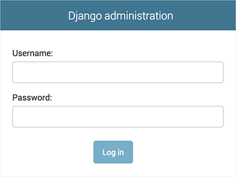
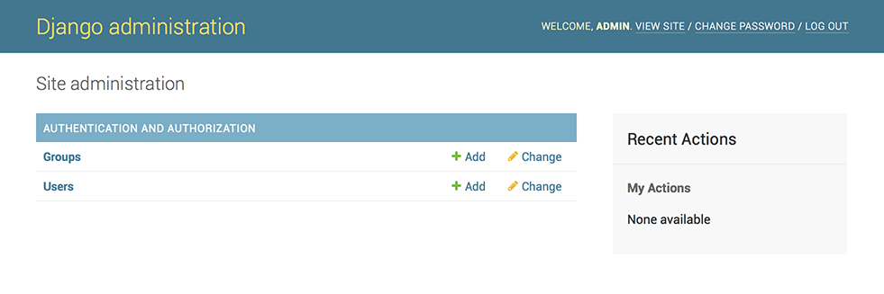
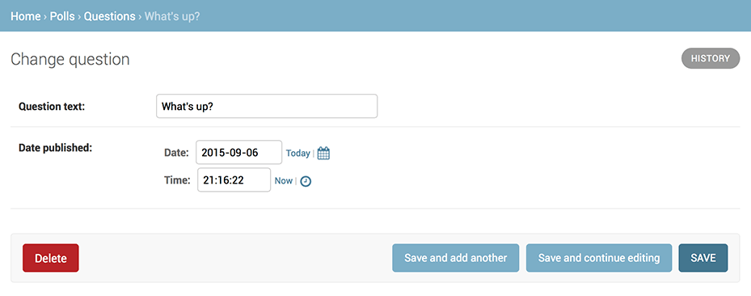

### 第一部分

#### 创建项目

```
django-admin startproject mysite
```

让我们看看 [`startproject`](https://docs.djangoproject.com/zh-hans/3.0/ref/django-admin/#django-admin-startproject) 创建了些什么:

```
mysite/
    manage.py
    mysite/
        __init__.py
        settings.py
        urls.py
        asgi.py
        wsgi.py
```

这些目录和文件的用处是：

- 最外层的 `mysite/` 根目录只是你项目的容器， 根目录名称对Django没有影响，你可以将它重命名为任何你喜欢的名称。
- `manage.py`: 一个让你用各种方式管理 Django 项目的命令行工具。你可以阅读 [django-admin and manage.py](https://docs.djangoproject.com/zh-hans/3.0/ref/django-admin/) 获取所有 `manage.py` 的细节。
- 里面一层的 `mysite/` 目录包含你的项目，它是一个纯 Python 包。它的名字就是当你引用它内部任何东西时需要用到的 Python 包名。 (比如 `mysite.urls`).
- `mysite/__init__.py`：一个空文件，告诉 Python 这个目录应该被认为是一个 Python 包。如果你是 Python 初学者，阅读官方文档中的 [更多关于包的知识](https://docs.python.org/3/tutorial/modules.html#tut-packages)。
- `mysite/settings.py`：Django 项目的配置文件。如果你想知道这个文件是如何工作的，请查看 [Django 配置](https://docs.djangoproject.com/zh-hans/3.0/topics/settings/) 了解细节。
- `mysite/urls.py`：Django 项目的 URL 声明，就像你网站的“目录”。阅读 [URL调度器](https://docs.djangoproject.com/zh-hans/3.0/topics/http/urls/) 文档来获取更多关于 URL 的内容。
- `mysite/asgi.py`：作为你的项目的运行在 ASGI 兼容的Web服务器上的入口。阅读 [如何使用 WSGI 进行部署](https://docs.djangoproject.com/zh-hans/3.0/howto/deployment/wsgi/) 了解更多细节。
- `mysite/wsgi.py`：作为你的项目的运行在 WSGI 兼容的Web服务器上的入口。阅读 [如何使用 WSGI 进行部署](https://docs.djangoproject.com/zh-hans/3.0/howto/deployment/wsgi/) 了解更多细节。

#### 运行

```
python manage.py runserver
```

#### 创建投票应用

现在你的开发环境——这个“项目” ——已经配置好了，你可以开始干活了。

在 Django 中，每一个应用都是一个 Python 包，并且遵循着相同的约定。Django 自带一个工具，可以帮你生成应用的基础目录结构，这样你就能专心写代码，而不是创建目录了。

你的应用可以存放在任何 [Python path](https://docs.python.org/3/tutorial/modules.html#tut-searchpath) 中定义的路径。在这个教程中，我们将在你的 `manage.py` 同级目录下创建投票应用。这样它就可以作为顶级模块导入，而不是 `mysite` 的子模块。

请确定你现在处于 `manage.py` 所在的目录下，然后运行这行命令来创建一个应用：

```
python manage.py startapp polls
```

这将会创建一个 `polls` 目录，它的目录结构大致如下：

```
polls/
    __init__.py
    admin.py
    apps.py
    migrations/
        __init__.py
    models.py
    tests.py
    views.py
```

这个目录结构包括了投票应用的全部内容。

#### 编写第一个视图

让我们开始编写第一个视图吧。打开 `polls/views.py`，把下面这些 Python 代码输入进去：

polls/views.py

```python
from django.http import HttpResponse


def index(request):
    return HttpResponse("Hello, world. You're at the polls index.")
```

这是 Django 中最简单的视图。如果想看见效果，我们需要将一个 URL 映射到它——这就是我们需要 URLconf 的原因了。

为了创建 URLconf，请在 polls 目录里新建一个 `urls.py` 文件。你的应用目录现在看起来应该是这样：

```
polls/
    __init__.py
    admin.py
    apps.py
    migrations/
        __init__.py
    models.py
    tests.py
    urls.py
    views.py
```

在 `polls/urls.py` 中，输入如下代码：

polls/urls.py

```python
from django.urls import path

from . import views

urlpatterns = [
    path('', views.index, name='index'),
]
```

下一步是要在根 URLconf 文件中指定我们创建的 `polls.urls` 模块。在 `mysite/urls.py` 文件的 `urlpatterns` 列表里插入一个 `include()`， 如下：

mysite/urls.py

```python
from django.contrib import admin
from django.urls import include, path

urlpatterns = [
    path('polls/', include('polls.urls')),
    path('admin/', admin.site.urls),
]
```

函数 [`include()`](https://docs.djangoproject.com/zh-hans/3.0/ref/urls/#django.urls.include) 允许引用其它 URLconfs。每当 Django 遇到 [`include()`](https://docs.djangoproject.com/zh-hans/3.0/ref/urls/#django.urls.include) 时，它会截断与此项匹配的 URL 的部分，并将剩余的字符串发送到 URLconf 以供进一步处理。

我们设计 [`include()`](https://docs.djangoproject.com/zh-hans/3.0/ref/urls/#django.urls.include) 的理念是使其可以即插即用。因为投票应用有它自己的 URLconf( `polls/urls.py` )，他们能够被放在 "/polls/" ， "/fun_polls/" ，"/content/polls/"，或者其他任何路径下，这个应用都能够正常工作。

当包括其它 URL 模式时你应该总是使用 `include()` ， `admin.site.urls` 是唯一例外。

#### path()

函数 [`path()`](https://docs.djangoproject.com/zh-hans/3.0/ref/urls/#django.urls.path) 具有四个参数，两个必须参数：`route` 和 `view`，两个可选参数：`kwargs` 和 `name`。现在，是时候来研究这些参数的含义了。

##### [`path()`](https://docs.djangoproject.com/zh-hans/3.0/ref/urls/#django.urls.path) 参数： `route`[¶](https://docs.djangoproject.com/zh-hans/3.0/intro/tutorial01/#path-argument-route)

`route` 是一个匹配 URL 的准则（类似正则表达式）。当 Django 响应一个请求时，它会从 `urlpatterns` 的第一项开始，按顺序依次匹配列表中的项，直到找到匹配的项。

这些准则不会匹配 GET 和 POST 参数或域名。例如，URLconf 在处理请求 `https://www.example.com/myapp/` 时，它会尝试匹配 `myapp/` 。处理请求 `https://www.example.com/myapp/?page=3` 时，也只会尝试匹配 `myapp/`。

##### [`path()`](https://docs.djangoproject.com/zh-hans/3.0/ref/urls/#django.urls.path) 参数： `view`[¶](https://docs.djangoproject.com/zh-hans/3.0/intro/tutorial01/#path-argument-view)

当 Django 找到了一个匹配的准则，就会调用这个特定的视图函数，并传入一个 [`HttpRequest`](https://docs.djangoproject.com/zh-hans/3.0/ref/request-response/#django.http.HttpRequest) 对象作为第一个参数，被“捕获”的参数以关键字参数的形式传入。稍后，我们会给出一个例子。

##### [`path()`](https://docs.djangoproject.com/zh-hans/3.0/ref/urls/#django.urls.path) 参数： `kwargs`[¶](https://docs.djangoproject.com/zh-hans/3.0/intro/tutorial01/#path-argument-kwargs)

任意个关键字参数可以作为一个字典传递给目标视图函数。本教程中不会使用这一特性。

##### [`path()`](https://docs.djangoproject.com/zh-hans/3.0/ref/urls/#django.urls.path) 参数： `name`[¶](https://docs.djangoproject.com/zh-hans/3.0/intro/tutorial01/#path-argument-name)

为你的 URL 取名能使你在 Django 的任意地方唯一地引用它，尤其是在模板中。这个有用的特性允许你只改一个文件就能全局地修改某个 URL 模式。

当你了解了基本的请求和响应流程后，请阅读 [教程的第 2 部分](https://docs.djangoproject.com/zh-hans/3.0/intro/tutorial02/) 开始使用数据库.

### 第二部分

#### 数据库配置

现在，打开 `mysite/settings.py` 。这是个包含了 Django 项目设置的 Python 模块。

如果你想使用其他数据库，你需要安装合适的 [database bindings](https://docs.djangoproject.com/zh-hans/3.0/topics/install/#database-installation) ，然后改变设置文件中 [`DATABASES`](https://docs.djangoproject.com/zh-hans/3.0/ref/settings/#std:setting-DATABASES) `'default'` 项目中的一些键值：

``` 
pip install mysqlclient
```

- [`ENGINE`](https://docs.djangoproject.com/zh-hans/3.0/ref/settings/#std:setting-DATABASE-ENGINE) -- 可选值有 `'django.db.backends.sqlite3'`，`'django.db.backends.postgresql'`，`'django.db.backends.mysql'`，或 `'django.db.backends.oracle'`。其它 [可用后端](https://docs.djangoproject.com/zh-hans/3.0/ref/databases/#third-party-notes)。
- [`NAME`](https://docs.djangoproject.com/zh-hans/3.0/ref/settings/#std:setting-NAME) - 数据库的名称。

```python
DATABASES = {
    'default': {
        'ENGINE': 'django.db.backends.mysql',
        'NAME': 'myweb',
        'USER': 'root',
        'PASSWORD': 'mysql',
        'HOST': '127.0.0.1',
        'PORT': '3306',
    }
}
```

编辑 `mysite/settings.py` 文件前，先设置 [`TIME_ZONE`](https://docs.djangoproject.com/zh-hans/3.0/ref/settings/#std:setting-TIME_ZONE) 为你自己时区。

```python
LANGUAGE_CODE = 'zh-hans'

TIME_ZONE = 'Asia/Shanghai'
```

此外，关注一下文件头部的 [`INSTALLED_APPS`](https://docs.djangoproject.com/zh-hans/3.0/ref/settings/#std:setting-INSTALLED_APPS) 设置项。这里包括了会在你项目中启用的所有 Django 应用。应用能在多个项目中使用，你也可以打包并且发布应用，让别人使用它们。

通常， [`INSTALLED_APPS`](https://docs.djangoproject.com/zh-hans/3.0/ref/settings/#std:setting-INSTALLED_APPS) 默认包括了以下 Django 的自带应用：

- [`django.contrib.admin`](https://docs.djangoproject.com/zh-hans/3.0/ref/contrib/admin/#module-django.contrib.admin) -- 管理员站点， 你很快就会使用它。
- [`django.contrib.auth`](https://docs.djangoproject.com/zh-hans/3.0/topics/auth/#module-django.contrib.auth) -- 认证授权系统。
- [`django.contrib.contenttypes`](https://docs.djangoproject.com/zh-hans/3.0/ref/contrib/contenttypes/#module-django.contrib.contenttypes) -- 内容类型框架。
- [`django.contrib.sessions`](https://docs.djangoproject.com/zh-hans/3.0/topics/http/sessions/#module-django.contrib.sessions) -- 会话框架。
- [`django.contrib.messages`](https://docs.djangoproject.com/zh-hans/3.0/ref/contrib/messages/#module-django.contrib.messages) -- 消息框架。
- [`django.contrib.staticfiles`](https://docs.djangoproject.com/zh-hans/3.0/ref/contrib/staticfiles/#module-django.contrib.staticfiles) -- 管理静态文件的框架。

这些应用被默认启用是为了给常规项目提供方便。

默认开启的某些应用需要至少一个数据表，所以，在使用他们之前需要在数据库中创建一些表。请执行以下命令：

```
$ python manage.py migrate
```

这个 [`migrate`](https://docs.djangoproject.com/zh-hans/3.0/ref/django-admin/#django-admin-migrate) 命令检查 [`INSTALLED_APPS`](https://docs.djangoproject.com/zh-hans/3.0/ref/settings/#std:setting-INSTALLED_APPS) 设置，为其中的每个应用创建需要的数据表，至于具体会创建什么，这取决于你的 `mysite/settings.py` 设置文件和每个应用的数据库迁移文件（我们稍后会介绍这个）。这个命令所执行的每个迁移操作都会在终端中显示出来。如果你感兴趣的话，运行你数据库的命令行工具，并输入 `\dt` (PostgreSQL)， `SHOW TABLES;` (MariaDB,MySQL)， `.schema` (SQLite)或者 `SELECT TABLE_NAME FROM USER_TABLES;` (Oracle) 来看看 Django 到底创建了哪些表。

> 写给极简主义者

> 就像之前说的，为了方便大多数项目，我们默认激活了一些应用，但并不是每个人都需要它们。如果你不需要某个或某些应用，你可以在运行 [`migrate`](https://docs.djangoproject.com/zh-hans/3.0/ref/django-admin/#django-admin-migrate) 前毫无顾虑地从 [`INSTALLED_APPS`](https://docs.djangoproject.com/zh-hans/3.0/ref/settings/#std:setting-INSTALLED_APPS) 里注释或者删除掉它们。 [`migrate`](https://docs.djangoproject.com/zh-hans/3.0/ref/django-admin/#django-admin-migrate) 命令只会为在 [`INSTALLED_APPS`](https://docs.djangoproject.com/zh-hans/3.0/ref/settings/#std:setting-INSTALLED_APPS) 里声明了的应用进行数据库迁移。

#### 创建模型

在 Django 里写一个数据库驱动的 Web 应用的第一步是定义模型 - 也就是数据库结构设计和附加的其它元数据。

在这个投票应用中，需要创建两个模型：问题 `Question` 和选项 `Choice`。`Question` 模型包括问题描述和发布时间。`Choice` 模型有两个字段，选项描述和当前得票数。每个选项属于一个问题。

这些概念可以通过一个 Python 类来描述。按照下面的例子来编辑 `polls/models.py` 文件：

polls/models.py

```python
from django.db import models


class Question(models.Model):
    question_text = models.CharField(max_length=200)
    pub_date = models.DateTimeField('date published')


class Choice(models.Model):
    question = models.ForeignKey(Question, on_delete=models.CASCADE)
    choice_text = models.CharField(max_length=200)
    votes = models.IntegerField(default=0)
```

每个模型被表示为 [`django.db.models.Model`](https://docs.djangoproject.com/zh-hans/3.0/ref/models/instances/#django.db.models.Model) 类的子类。每个模型有许多类变量，它们都表示模型里的一个数据库字段。

每个字段都是 [`Field`](https://docs.djangoproject.com/zh-hans/3.0/ref/models/fields/#django.db.models.Field) 类的实例 - 比如，字符字段被表示为 [`CharField`](https://docs.djangoproject.com/zh-hans/3.0/ref/models/fields/#django.db.models.CharField) ，日期时间字段被表示为 [`DateTimeField`](https://docs.djangoproject.com/zh-hans/3.0/ref/models/fields/#django.db.models.DateTimeField) 。这将告诉 Django 每个字段要处理的数据类型。

每个 [`Field`](https://docs.djangoproject.com/zh-hans/3.0/ref/models/fields/#django.db.models.Field) 类实例变量的名字（例如 `question_text` 或 `pub_date` ）也是字段名，所以最好使用对机器友好的格式。你将会在 Python 代码里使用它们，而数据库会将它们作为列名。

你可以使用可选的选项来为 [`Field`](https://docs.djangoproject.com/zh-hans/3.0/ref/models/fields/#django.db.models.Field) 定义一个人类可读的名字。这个功能在很多 Django 内部组成部分中都被使用了，而且作为文档的一部分。如果某个字段没有提供此名称，Django 将会使用对机器友好的名称，也就是变量名。在上面的例子中，我们只为 `Question.pub_date` 定义了对人类友好的名字。对于模型内的其它字段，它们的机器友好名也会被作为人类友好名使用。

定义某些 [`Field`](https://docs.djangoproject.com/zh-hans/3.0/ref/models/fields/#django.db.models.Field) 类实例需要参数。例如 [`CharField`](https://docs.djangoproject.com/zh-hans/3.0/ref/models/fields/#django.db.models.CharField) 需要一个 [`max_length`](https://docs.djangoproject.com/zh-hans/3.0/ref/models/fields/#django.db.models.CharField.max_length) 参数。这个参数的用处不止于用来定义数据库结构，也用于验证数据，我们稍后将会看到这方面的内容。

[`Field`](https://docs.djangoproject.com/zh-hans/3.0/ref/models/fields/#django.db.models.Field) 也能够接收多个可选参数；在上面的例子中：我们将 `votes` 的 [`default`](https://docs.djangoproject.com/zh-hans/3.0/ref/models/fields/#django.db.models.Field.default) 也就是默认值，设为0。

注意在最后，我们使用 [`ForeignKey`](https://docs.djangoproject.com/zh-hans/3.0/ref/models/fields/#django.db.models.ForeignKey) 定义了一个关系。这将告诉 Django，每个 `Choice` 对象都关联到一个 `Question` 对象。Django 支持所有常用的数据库关系：多对一、多对多和一对一。

#### 激活模型

上面的一小段用于创建模型的代码给了 Django 很多信息，通过这些信息，Django 可以：

- 为这个应用创建数据库 schema（生成 `CREATE TABLE` 语句）。
- 创建可以与 `Question` 和 `Choice` 对象进行交互的 Python 数据库 API。

但是首先得把 `polls` 应用安装到我们的项目里。

为了在我们的工程中包含这个应用，我们需要在配置类 [`INSTALLED_APPS`](https://docs.djangoproject.com/zh-hans/3.0/ref/settings/#std:setting-INSTALLED_APPS) 中添加设置。因为 `PollsConfig` 类写在文件 `polls/apps.py` 中，所以它的点式路径是 `'polls.apps.PollsConfig'`。在文件 `mysite/settings.py` 中 [`INSTALLED_APPS`](https://docs.djangoproject.com/zh-hans/3.0/ref/settings/#std:setting-INSTALLED_APPS) 子项添加点式路径后，它看起来像这样：

mysite/settings.py

```python
INSTALLED_APPS = [
    'polls.apps.PollsConfig',
    'django.contrib.admin',
    'django.contrib.auth',
    'django.contrib.contenttypes',
    'django.contrib.sessions',
    'django.contrib.messages',
    'django.contrib.staticfiles',
]
```

现在你的 Django 项目会包含 `polls` 应用。接着运行下面的命令：

```
$ python manage.py makemigrations polls
```

你将会看到类似于下面这样的输出：

```
Migrations for 'polls':
  polls/migrations/0001_initial.py
    - Create model Question
    - Create model Choice
```

通过运行 `makemigrations` 命令，Django 会检测你对模型文件的修改（在这种情况下，你已经取得了新的），并且把修改的部分储存为一次 *迁移*。

迁移是 Django 对于模型定义（也就是你的数据库结构）的变化的储存形式 - 它们其实也只是一些你磁盘上的文件。如果你想的话，你可以阅读一下你模型的迁移数据，它被储存在 `polls/migrations/0001_initial.py` 里。别担心，你不需要每次都阅读迁移文件，但是它们被设计成人类可读的形式，这是为了便于你手动调整Django的修改方式。

Django 有一个自动执行数据库迁移并同步管理你的数据库结构的命令 - 这个命令是 [`migrate`](https://docs.djangoproject.com/zh-hans/3.0/ref/django-admin/#django-admin-migrate)，我们马上就会接触它 - 但是首先，让我们看看迁移命令会执行哪些 SQL 语句。[`sqlmigrate`](https://docs.djangoproject.com/zh-hans/3.0/ref/django-admin/#django-admin-sqlmigrate) 命令接收一个迁移的名称，然后返回对应的 SQL：

```
$ python manage.py sqlmigrate polls 0001
```

你将会看到类似下面这样的输出（我把输出重组成了人类可读的格式）

```sql
BEGIN;
--
-- Create model Question
--
CREATE TABLE "polls_question" (
    "id" serial NOT NULL PRIMARY KEY,
    "question_text" varchar(200) NOT NULL,
    "pub_date" timestamp with time zone NOT NULL
);
--
-- Create model Choice
--
CREATE TABLE "polls_choice" (
    "id" serial NOT NULL PRIMARY KEY,
    "choice_text" varchar(200) NOT NULL,
    "votes" integer NOT NULL,
    "question_id" integer NOT NULL
);
ALTER TABLE "polls_choice"
  ADD CONSTRAINT "polls_choice_question_id_c5b4b260_fk_polls_question_id"
    FOREIGN KEY ("question_id")
    REFERENCES "polls_question" ("id")
    DEFERRABLE INITIALLY DEFERRED;
CREATE INDEX "polls_choice_question_id_c5b4b260" ON "polls_choice" ("question_id");

COMMIT;
```

请注意以下几点：

- 输出的内容和你使用的数据库有关，上面的输出示例使用的是 PostgreSQL。
- 数据库的表名是由应用名(`polls`)和模型名的小写形式( `question` 和 `choice`)连接而来。（如果需要，你可以自定义此行为。）
- 主键(IDs)会被自动创建。(当然，你也可以自定义。)
- 默认的，Django 会在外键字段名后追加字符串 `"_id"` 。（同样，这也可以自定义。）
- 外键关系由 `FOREIGN KEY` 生成。你不用关心 `DEFERRABLE` 部分，它只是告诉 PostgreSQL，请在事务全都执行完之后再创建外键关系。
- 生成的 SQL 语句是为你所用的数据库定制的，所以那些和数据库有关的字段类型，比如 `auto_increment` (MySQL)、 `serial` (PostgreSQL)和 `integer primary key autoincrement` (SQLite)，Django 会帮你自动处理。那些和引号相关的事情 - 例如，是使用单引号还是双引号 - 也一样会被自动处理。
- 这个 [`sqlmigrate`](https://docs.djangoproject.com/zh-hans/3.0/ref/django-admin/#django-admin-sqlmigrate) 命令并没有真正在你的数据库中的执行迁移 - 相反，它只是把命令输出到屏幕上，让你看看 Django 认为需要执行哪些 SQL 语句。这在你想看看 Django 到底准备做什么，或者当你是数据库管理员，需要写脚本来批量处理数据库时会很有用。

如果你感兴趣，你也可以试试运行 [`python manage.py check`](https://docs.djangoproject.com/zh-hans/3.0/ref/django-admin/#django-admin-check) ;这个命令帮助你检查项目中的问题，并且在检查过程中不会对数据库进行任何操作。

现在，再次运行 [`migrate`](https://docs.djangoproject.com/zh-hans/3.0/ref/django-admin/#django-admin-migrate) 命令，在数据库里创建新定义的模型的数据表：

```
$ python manage.py migrate
Operations to perform:
  Apply all migrations: admin, auth, contenttypes, polls, sessions
Running migrations:
  Rendering model states... DONE
  Applying polls.0001_initial... OK
```

这个 [`migrate`](https://docs.djangoproject.com/zh-hans/3.0/ref/django-admin/#django-admin-migrate) 命令选中所有还没有执行过的迁移（Django 通过在数据库中创建一个特殊的表 `django_migrations` 来跟踪执行过哪些迁移）并应用在数据库上 - 也就是将你对模型的更改同步到数据库结构上。

迁移是非常强大的功能，它能让你在开发过程中持续的改变数据库结构而不需要重新删除和创建表 - 它专注于使数据库平滑升级而不会丢失数据。我们会在后面的教程中更加深入的学习这部分内容，现在，你只需要记住，改变模型需要这三步：

- 编辑 `models.py` 文件，改变模型。
- 运行 [`python manage.py makemigrations`](https://docs.djangoproject.com/zh-hans/3.0/ref/django-admin/#django-admin-makemigrations) 为模型的改变生成迁移文件。
- 运行 [`python manage.py migrate`](https://docs.djangoproject.com/zh-hans/3.0/ref/django-admin/#django-admin-migrate) 来应用数据库迁移。

数据库迁移被分解成生成和应用两个命令是为了让你能够在代码控制系统上提交迁移数据并使其能在多个应用里使用；这不仅仅会让开发更加简单，也给别的开发者和生产环境中的使用带来方便。

通过阅读文档 [Django 后台文档](https://docs.djangoproject.com/zh-hans/3.0/ref/django-admin/) ，你可以获得关于 `manage.py` 工具的更多信息。

#### 初试API

现在让我们进入交互式 Python 命令行，尝试一下 Django 为你创建的各种 API。通过以下命令打开 Python 命令行：

```
$ python manage.py shell
```

我们使用这个命令而不是简单的使用 "Python" 是因为 `manage.py` 会设置 `DJANGO_SETTINGS_MODULE` 环境变量，这个变量会让 Django 根据 `mysite/settings.py` 文件来设置 Python 包的导入路径。

当你成功进入命令行后，来试试 [database API](https://docs.djangoproject.com/zh-hans/3.0/topics/db/queries/) 吧:

```shell
>>> from polls.models import Choice, Question  # Import the model classes we just wrote.

# No questions are in the system yet.
>>> Question.objects.all()
<QuerySet []>

# Create a new Question.
# Support for time zones is enabled in the default settings file, so
# Django expects a datetime with tzinfo for pub_date. Use timezone.now()
# instead of datetime.datetime.now() and it will do the right thing.
>>> from django.utils import timezone
>>> q = Question(question_text="What's new?", pub_date=timezone.now())

# Save the object into the database. You have to call save() explicitly.
>>> q.save()

# Now it has an ID.
>>> q.id
1

# Access model field values via Python attributes.
>>> q.question_text
"What's new?"
>>> q.pub_date
datetime.datetime(2012, 2, 26, 13, 0, 0, 775217, tzinfo=<UTC>)

# Change values by changing the attributes, then calling save().
>>> q.question_text = "What's up?"
>>> q.save()

# objects.all() displays all the questions in the database.
>>> Question.objects.all()
<QuerySet [<Question: Question object (1)>]>
```

等等。`` 对于我们了解这个对象的细节没什么帮助。让我们通过编辑 `Question` 模型的代码（位于 `polls/models.py` 中）来修复这个问题。给 `Question` 和 `Choice` 增加 [`__str__()`](https://docs.djangoproject.com/zh-hans/3.0/ref/models/instances/#django.db.models.Model.__str__) 方法。

polls/models.py

```python
from django.db import models

class Question(models.Model):
    # ...
    def __str__(self):
        return self.question_text

class Choice(models.Model):
    # ...
    def __str__(self):
        return self.choice_text
```

给模型增加 [`__str__()`](https://docs.djangoproject.com/zh-hans/3.0/ref/models/instances/#django.db.models.Model.__str__) 方法是很重要的，这不仅仅能给你在命令行里使用带来方便，Django 自动生成的 admin 里也使用这个方法来表示对象。

让我们再为此模型添加一个自定义方法：

polls/models.py

```python
import datetime

from django.db import models
from django.utils import timezone


class Question(models.Model):
    # ...
    def was_published_recently(self):
        return self.pub_date >= timezone.now() - datetime.timedelta(days=1)
```

新加入的 `import datetime` 和 `from django.utils import timezone` 分别导入了 Python 的标准 [`datetime`](https://docs.python.org/3/library/datetime.html#module-datetime) 模块和 Django 中和时区相关的 [`django.utils.timezone`](https://docs.djangoproject.com/zh-hans/3.0/ref/utils/#module-django.utils.timezone) 工具模块。如果你不太熟悉 Python 中的时区处理，看看 [时区支持文档](https://docs.djangoproject.com/zh-hans/3.0/topics/i18n/timezones/) 吧。

保存文件然后通过 `python manage.py shell` 命令再次打开 Python 交互式命令行：

```shell
>>> from polls.models import Choice, Question

# Make sure our __str__() addition worked.
>>> Question.objects.all()
<QuerySet [<Question: What's up?>]>

# Django provides a rich database lookup API that's entirely driven by
# keyword arguments.
>>> Question.objects.filter(id=1)
<QuerySet [<Question: What's up?>]>
>>> Question.objects.filter(question_text__startswith='What')
<QuerySet [<Question: What's up?>]>

# Get the question that was published this year.
>>> from django.utils import timezone
>>> current_year = timezone.now().year
>>> Question.objects.get(pub_date__year=current_year)
<Question: What's up?>

# Request an ID that doesn't exist, this will raise an exception.
>>> Question.objects.get(id=2)
Traceback (most recent call last):
    ...
DoesNotExist: Question matching query does not exist.

# Lookup by a primary key is the most common case, so Django provides a
# shortcut for primary-key exact lookups.
# The following is identical to Question.objects.get(id=1).
>>> Question.objects.get(pk=1)
<Question: What's up?>

# Make sure our custom method worked.
>>> q = Question.objects.get(pk=1)
>>> q.was_published_recently()
True

# Give the Question a couple of Choices. The create call constructs a new
# Choice object, does the INSERT statement, adds the choice to the set
# of available choices and returns the new Choice object. Django creates
# a set to hold the "other side" of a ForeignKey relation
# (e.g. a question's choice) which can be accessed via the API.
>>> q = Question.objects.get(pk=1)

# Display any choices from the related object set -- none so far.
>>> q.choice_set.all()
<QuerySet []>

# Create three choices.
>>> q.choice_set.create(choice_text='Not much', votes=0)
<Choice: Not much>
>>> q.choice_set.create(choice_text='The sky', votes=0)
<Choice: The sky>
>>> c = q.choice_set.create(choice_text='Just hacking again', votes=0)

# Choice objects have API access to their related Question objects.
>>> c.question
<Question: What's up?>

# And vice versa: Question objects get access to Choice objects.
>>> q.choice_set.all()
<QuerySet [<Choice: Not much>, <Choice: The sky>, <Choice: Just hacking again>]>
>>> q.choice_set.count()
3

# The API automatically follows relationships as far as you need.
# Use double underscores to separate relationships.
# This works as many levels deep as you want; there's no limit.
# Find all Choices for any question whose pub_date is in this year
# (reusing the 'current_year' variable we created above).
>>> Choice.objects.filter(question__pub_date__year=current_year)
<QuerySet [<Choice: Not much>, <Choice: The sky>, <Choice: Just hacking again>]>

# Let's delete one of the choices. Use delete() for that.
>>> c = q.choice_set.filter(choice_text__startswith='Just hacking')
>>> c.delete()
```

阅读 [访问关系对象](https://docs.djangoproject.com/zh-hans/3.0/ref/models/relations/) 文档可以获取关于数据库关系的更多内容。想知道关于双下划线的更多用法，参见 [查找字段](https://docs.djangoproject.com/zh-hans/3.0/topics/db/queries/#field-lookups-intro) 文档。数据库 API 的所有细节可以在 [数据库 API 参考](https://docs.djangoproject.com/zh-hans/3.0/topics/db/queries/) 文档中找到。

#### 介绍django管理页面

##### 创建一个管理员账号[¶](https://docs.djangoproject.com/zh-hans/3.0/intro/tutorial02/#creating-an-admin-user)

首先，我们得创建一个能登录管理页面的用户。请运行下面的命令：

```
$ python manage.py createsuperuser
```

键入你想要使用的用户名，然后按下回车键：

```
Username: admin
```

然后提示你输入想要使用的邮件地址：

```
Email address: admin@example.com
```

最后一步是输入密码。你会被要求输入两次密码，第二次的目的是为了确认第一次输入的确实是你想要的密码。

```
Password: **********
Password (again): *********
Superuser created successfully.
```

##### 启动开发服务器

Django 的管理界面默认就是启用的。让我们启动开发服务器，看看它到底是什么样的。

如果开发服务器未启动，用以下命令启动它：

```
$ python manage.py runserver
```

现在，打开浏览器，转到你本地域名的 "/admin/" 目录， -- 比如 "http://127.0.0.1:8000/admin/" 。你应该会看见管理员登录界面：



Since [translation](https://docs.djangoproject.com/zh-hans/3.0/topics/i18n/translation/) is turned on by default, if you set [`LANGUAGE_CODE`](https://docs.djangoproject.com/zh-hans/3.0/ref/settings/#std:setting-LANGUAGE_CODE), the login screen will be displayed in the given language (if Django has appropriate translations).

##### 进入管理站点页面

现在，试着使用你在上一步中创建的超级用户来登录。然后你将会看到 Django 管理页面的索引页：



你将会看到几种可编辑的内容：组和用户。它们是由 [`django.contrib.auth`](https://docs.djangoproject.com/zh-hans/3.0/topics/auth/#module-django.contrib.auth) 提供的，这是 Django 开发的认证框架。

##### 向管理页面中加入投票应用

但是我们的投票应用在哪呢？它没在索引页面里显示。

只需要再做一件事：我们得告诉管理员，问题 `Question` 对象需要一个后台接口。打开 `polls/admin.py` 文件，把它编辑成下面这样：

polls/admin.py

```
from django.contrib import admin

from .models import Question

admin.site.register(Question)
```

##### 体验便捷的管理功能

现在我们向管理页面注册了问题 `Question` 类。Django 知道它应该被显示在索引页里：


点击 "Questions" 。现在看到是问题 "Questions" 对象的列表 "change list" 。这个界面会显示所有数据库里的问题 Question 对象，你可以选择一个来修改。这里现在有我们在上一部分中创建的 “What's up?” 问题。


点击 “What's up?” 来编辑这个问题（Question）对象：



注意事项：

- 这个表单是从问题 `Question` 模型中自动生成的
- 不同的字段类型（日期时间字段 [`DateTimeField`](https://docs.djangoproject.com/zh-hans/3.0/ref/models/fields/#django.db.models.DateTimeField) 、字符字段 [`CharField`](https://docs.djangoproject.com/zh-hans/3.0/ref/models/fields/#django.db.models.CharField)）会生成对应的 HTML 输入控件。每个类型的字段都知道它们该如何在管理页面里显示自己。
- 每个日期时间字段 [`DateTimeField`](https://docs.djangoproject.com/zh-hans/3.0/ref/models/fields/#django.db.models.DateTimeField) 都有 JavaScript 写的快捷按钮。日期有转到今天（Today）的快捷按钮和一个弹出式日历界面。时间有设为现在（Now）的快捷按钮和一个列出常用时间的方便的弹出式列表。

页面的底部提供了几个选项：

- 保存（Save） - 保存改变，然后返回对象列表。
- 保存并继续编辑（Save and continue editing） - 保存改变，然后重新载入当前对象的修改界面。
- 保存并新增（Save and add another） - 保存改变，然后添加一个新的空对象并载入修改界面。
- 删除（Delete） - 显示一个确认删除页面。

如果显示的 “发布日期(Date Published)” 和你在 [教程 1](https://docs.djangoproject.com/zh-hans/3.0/intro/tutorial01/) 里创建它们的时间不一致，这意味着你可能没有正确的设置 [`TIME_ZONE`](https://docs.djangoproject.com/zh-hans/3.0/ref/settings/#std:setting-TIME_ZONE) 。改变设置，然后重新载入页面看看是否显示了正确的值。

通过点击 “今天(Today)” 和 “现在(Now)” 按钮改变 “发布日期(Date Published)”。然后点击 “保存并继续编辑(Save and add another)”按钮。然后点击右上角的 “历史(History)”按钮。你会看到一个列出了所有通过 Django 管理页面对当前对象进行的改变的页面，其中列出了时间戳和进行修改操作的用户名：


当你熟悉了数据库 API 之后，你就可以开始阅读 [教程第 3 部分](https://docs.djangoproject.com/zh-hans/3.0/intro/tutorial03/) ，下一部分我们将会学习如何为投票应用添加更多视图。

### 第三部分

#### 概况

Django 中的视图的概念是「一类具有相同功能和模板的网页的集合」。比如，在一个博客应用中，你可能会创建如下几个视图：

- 博客首页——展示最近的几项内容。
- 内容“详情”页——详细展示某项内容。
- 以年为单位的归档页——展示选中的年份里各个月份创建的内容。
- 以月为单位的归档页——展示选中的月份里各天创建的内容。
- 以天为单位的归档页——展示选中天里创建的所有内容。
- 评论处理器——用于响应为一项内容添加评论的操作。

而在我们的投票应用中，我们需要下列几个视图：

- 问题索引页——展示最近的几个投票问题。
- 问题详情页——展示某个投票的问题和不带结果的选项列表。
- 问题结果页——展示某个投票的结果。
- 投票处理器——用于响应用户为某个问题的特定选项投票的操作。

在 Django 中，网页和其他内容都是从视图派生而来。每一个视图表现为一个 Python 函数（或者说方法，如果是在基于类的视图里的话）。Django 将会根据用户请求的 URL 来选择使用哪个视图（更准确的说，是根据 URL 中域名之后的部分）。

Now in your time on the web you may have come across such beauties as `ME2/Sites/dirmod.htm?sid=&type=gen&mod=Core+Pages&gid=A6CD4967199A42D9B65B1B`. You will be pleased to know that Django allows us much more elegant *URL patterns* than that.

URL模式是URL的一般形式 - 例如: `/newsarchive///`.

为了将 URL 和视图关联起来，Django 使用了 'URLconfs' 来配置。URLconf 将 URL 模式映射到视图。

本教程只会介绍 URLconf 的基础内容，你可以看看 [URL调度器](https://docs.djangoproject.com/zh-hans/3.0/topics/http/urls/) 以获取更多内容。

#### 编写更多视图

现在让我们向 `polls/views.py` 里添加更多视图。这些视图有一些不同，因为他们接收参数：

polls/views.py

```python
def detail(request, question_id):
    return HttpResponse("You're looking at question %s." % question_id)

def results(request, question_id):
    response = "You're looking at the results of question %s."
    return HttpResponse(response % question_id)

def vote(request, question_id):
    return HttpResponse("You're voting on question %s." % question_id)
```

把这些新视图添加进 `polls.urls` 模块里，只要添加几个 [`url()`](https://docs.djangoproject.com/zh-hans/3.0/ref/urls/#django.conf.urls.url) 函数调用就行：

polls/urls.py

```python
from django.urls import path

from . import views

urlpatterns = [
    # ex: /polls/
    path('', views.index, name='index'),
    # ex: /polls/5/
    path('<int:question_id>/', views.detail, name='detail'),
    # ex: /polls/5/results/
    path('<int:question_id>/results/', views.results, name='results'),
    # ex: /polls/5/vote/
    path('<int:question_id>/vote/', views.vote, name='vote'),
]
```

然后看看你的浏览器，如果你转到 "/polls/34/" ，Django 将会运行 `detail()` 方法并且展示你在 URL 里提供的问题 ID。再试试 "/polls/34/vote/" 和 "/polls/34/vote/" ——你将会看到暂时用于占位的结果和投票页。

当某人请求你网站的某一页面时——比如说， "/polls/34/" ，Django 将会载入 `mysite.urls` 模块，因为这在配置项 [`ROOT_URLCONF`](https://docs.djangoproject.com/zh-hans/3.0/ref/settings/#std:setting-ROOT_URLCONF) 中设置了。然后 Django 寻找名为 `urlpatterns` 变量并且按序匹配正则表达式。在找到匹配项 `'polls/'`，它切掉了匹配的文本（`"polls/"`），将剩余文本——`"34/"`，发送至 'polls.urls' URLconf 做进一步处理。在这里剩余文本匹配了 `'/'`，使得我们 Django 以如下形式调用 `detail()`:

```python
detail(request=<HttpRequest object>, question_id=34)
```

`question_id=34` 由 `` 匹配生成。使用尖括号“捕获”这部分 URL，且以关键字参数的形式发送给视图函数。上述字符串的 `:question_id>` 部分定义了将被用于区分匹配模式的变量名，而 `int:` 则是一个转换器决定了应该以什么变量类型匹配这部分的 URL 路径。

为每个 URL 加上不必要的东西，例如 `.html` ，是没有必要的。不过如果你非要加的话，也是可以的:

```python
path('polls/latest.html', views.index),
```

**但是，别这样做，这太傻了。**

#### 写一个真正有用的视图

每个视图必须要做的只有两件事：返回一个包含被请求页面内容的 [`HttpResponse`](https://docs.djangoproject.com/zh-hans/3.0/ref/request-response/#django.http.HttpResponse) 对象，或者抛出一个异常，比如 [`Http404`](https://docs.djangoproject.com/zh-hans/3.0/topics/http/views/#django.http.Http404) 。至于你还想干些什么，随便你。

你的视图可以从数据库里读取记录，可以使用一个模板引擎（比如 Django 自带的，或者其他第三方的），可以生成一个 PDF 文件，可以输出一个 XML，创建一个 ZIP 文件，你可以做任何你想做的事，使用任何你想用的 Python 库。

Django 只要求返回的是一个 [`HttpResponse`](https://docs.djangoproject.com/zh-hans/3.0/ref/request-response/#django.http.HttpResponse) ，或者抛出一个异常。

因为 Django 自带的数据库 API 很方便，我们曾在 [教程第 2 部分](https://docs.djangoproject.com/zh-hans/3.0/intro/tutorial02/) 中学过，所以我们试试在视图里使用它。我们在 `index()` 函数里插入了一些新内容，让它能展示数据库里以发布日期排序的最近 5 个投票问题，以空格分割：

polls/views.py

```python
from django.http import HttpResponse

from .models import Question


def index(request):
    latest_question_list = Question.objects.order_by('-pub_date')[:5]
    output = ', '.join([q.question_text for q in latest_question_list])
    return HttpResponse(output)

# Leave the rest of the views (detail, results, vote) unchanged
```

这里有个问题：页面的设计写死在视图函数的代码里的。如果你想改变页面的样子，你需要编辑 Python 代码。所以让我们使用 Django 的模板系统，只要创建一个视图，就可以将页面的设计从代码中分离出来。

首先，在你的 `polls` 目录里创建一个 `templates` 目录。Django 将会在这个目录里查找模板文件。

你项目的 [`TEMPLATES`](https://docs.djangoproject.com/zh-hans/3.0/ref/settings/#std:setting-TEMPLATES) 配置项描述了 Django 如何载入和渲染模板。默认的设置文件设置了 `DjangoTemplates` 后端，并将 [`APP_DIRS`](https://docs.djangoproject.com/zh-hans/3.0/ref/settings/#std:setting-TEMPLATES-APP_DIRS) 设置成了 True。这一选项将会让 `DjangoTemplates` 在每个 [`INSTALLED_APPS`](https://docs.djangoproject.com/zh-hans/3.0/ref/settings/#std:setting-INSTALLED_APPS) 文件夹中寻找 "templates" 子目录。这就是为什么尽管我们没有像在第二部分中那样修改 DIRS 设置，Django 也能正确找到 polls 的模板位置的原因。

在你刚刚创建的 `templates` 目录里，再创建一个目录 `polls`，然后在其中新建一个文件 `index.html` 。换句话说，你的模板文件的路径应该是 `polls/templates/polls/index.html` 。因为``app_directories`` 模板加载器是通过上述描述的方法运行的，所以Django可以引用到 `polls/index.html` 这一模板了。

模板命名空间

虽然我们现在可以将模板文件直接放在 `polls/templates` 文件夹中（而不是再建立一个 `polls` 子文件夹），但是这样做不太好。Django 将会选择第一个匹配的模板文件，如果你有一个模板文件正好和另一个应用中的某个模板文件重名，Django 没有办法 *区分* 它们。我们需要帮助 Django 选择正确的模板，最好的方法就是把他们放入各自的 *命名空间* 中，也就是把这些模板放入一个和 *自身* 应用重名的子文件夹里。

将下面的代码输入到刚刚创建的模板文件中：

polls/templates/polls/index.html

```html

    <ul>
    
        <li><a href="/polls/{{ question.id }}/">{{ question.question_text }}</a></li>
    
    </ul>

    <p>No polls are available.</p>

```

注解

为了让教程看起来不那么长，所有的模板文件都只写出了核心代码。在你自己创建的项目中，你应该使用 [完整的 HTML 文档](https://developer.mozilla.org/en-US/docs/Learn/HTML/Introduction_to_HTML/Getting_started#Anatomy_of_an_HTML_document).

然后，让我们更新一下 `polls/views.py` 里的 `index` 视图来使用模板：

polls/views.py

```python
from django.http import HttpResponse
from django.template import loader

from .models import Question


def index(request):
    latest_question_list = Question.objects.order_by('-pub_date')[:5]
    template = loader.get_template('polls/index.html')
    context = {
        'latest_question_list': latest_question_list,
    }
    return HttpResponse(template.render(context, request))
```

上述代码的作用是，载入 `polls/index.html` 模板文件，并且向它传递一个上下文(context)。这个上下文是一个字典，它将模板内的变量映射为 Python 对象。

用你的浏览器访问 "/polls/" ，你将会看见一个无序列表，列出了我们在 [教程第 2 部分](https://docs.djangoproject.com/zh-hans/3.0/intro/tutorial02/) 中添加的 “What's up” 投票问题，链接指向这个投票的详情页。

#### 一个快捷函数： [`render()`]

「载入模板，填充上下文，再返回由它生成的 [`HttpResponse`](https://docs.djangoproject.com/zh-hans/3.0/ref/request-response/#django.http.HttpResponse) 对象」是一个非常常用的操作流程。于是 Django 提供了一个快捷函数，我们用它来重写 `index()` 视图：

polls/views.py

```python
from django.shortcuts import render

from .models import Question


def index(request):
    latest_question_list = Question.objects.order_by('-pub_date')[:5]
    context = {'latest_question_list': latest_question_list}
    return render(request, 'polls/index.html', context)
```

注意到，我们不再需要导入 [`loader`](https://docs.djangoproject.com/zh-hans/3.0/topics/templates/#module-django.template.loader) 和 [`HttpResponse`](https://docs.djangoproject.com/zh-hans/3.0/ref/request-response/#django.http.HttpResponse) 。不过如果你还有其他函数（比如说 `detail`, `results`, 和 `vote` ）需要用到它的话，就需要保持 `HttpResponse` 的导入。

The [`render()`](https://docs.djangoproject.com/zh-hans/3.0/topics/http/shortcuts/#django.shortcuts.render) function takes the request object as its first argument, a template name as its second argument and a dictionary as its optional third argument. It returns an [`HttpResponse`](https://docs.djangoproject.com/zh-hans/3.0/ref/request-response/#django.http.HttpResponse) object of the given template rendered with the given context.

#### 抛出 404 错误

现在，我们来处理投票详情视图——它会显示指定投票的问题标题。下面是这个视图的代码：

polls/views.py

```python
from django.http import Http404
from django.shortcuts import render

from .models import Question
# ...
def detail(request, question_id):
    try:
        question = Question.objects.get(pk=question_id)
    except Question.DoesNotExist:
        raise Http404("Question does not exist")
    return render(request, 'polls/detail.html', {'question': question})
```

这里有个新原则。如果指定问题 ID 所对应的问题不存在，这个视图就会抛出一个 [`Http404`](https://docs.djangoproject.com/zh-hans/3.0/topics/http/views/#django.http.Http404) 异常。

我们稍后再讨论你需要在 `polls/detail.html` 里输入什么，但是如果你想试试上面这段代码是否正常工作的话，你可以暂时把下面这段输进去：

polls/templates/polls/detail.html

```html
{{ question }}
```

这样你就能测试了。

#### 一个快捷函数： [`get_object_or_404()`]

尝试用 [`get()`](https://docs.djangoproject.com/zh-hans/3.0/ref/models/querysets/#django.db.models.query.QuerySet.get) 函数获取一个对象，如果不存在就抛出 [`Http404`](https://docs.djangoproject.com/zh-hans/3.0/topics/http/views/#django.http.Http404) 错误也是一个普遍的流程。Django 也提供了一个快捷函数，下面是修改后的详情 `detail()` 视图代码：

polls/views.py

```python
from django.shortcuts import get_object_or_404, render

from .models import Question
# ...
def detail(request, question_id):
    question = get_object_or_404(Question, pk=question_id)
    return render(request, 'polls/detail.html', {'question': question})
```

The [`get_object_or_404()`](https://docs.djangoproject.com/zh-hans/3.0/topics/http/shortcuts/#django.shortcuts.get_object_or_404) function takes a Django model as its first argument and an arbitrary number of keyword arguments, which it passes to the [`get()`](https://docs.djangoproject.com/zh-hans/3.0/ref/models/querysets/#django.db.models.query.QuerySet.get) function of the model's manager. It raises [`Http404`](https://docs.djangoproject.com/zh-hans/3.0/topics/http/views/#django.http.Http404) if the object doesn't exist.

设计哲学

为什么我们使用辅助函数 [`get_object_or_404()`](https://docs.djangoproject.com/zh-hans/3.0/topics/http/shortcuts/#django.shortcuts.get_object_or_404) 而不是自己捕获 [`ObjectDoesNotExist`](https://docs.djangoproject.com/zh-hans/3.0/ref/exceptions/#django.core.exceptions.ObjectDoesNotExist) 异常呢？还有，为什么模型 API 不直接抛出 [`ObjectDoesNotExist`](https://docs.djangoproject.com/zh-hans/3.0/ref/exceptions/#django.core.exceptions.ObjectDoesNotExist) 而是抛出 [`Http404`](https://docs.djangoproject.com/zh-hans/3.0/topics/http/views/#django.http.Http404) 呢？

因为这样做会增加模型层和视图层的耦合性。指导 Django 设计的最重要的思想之一就是要保证松散耦合。一些受控的耦合将会被包含在 [`django.shortcuts`](https://docs.djangoproject.com/zh-hans/3.0/topics/http/shortcuts/#module-django.shortcuts) 模块中。

也有 [`get_list_or_404()`](https://docs.djangoproject.com/zh-hans/3.0/topics/http/shortcuts/#django.shortcuts.get_list_or_404) 函数，工作原理和 [`get_object_or_404()`](https://docs.djangoproject.com/zh-hans/3.0/topics/http/shortcuts/#django.shortcuts.get_object_or_404) 一样，除了 [`get()`](https://docs.djangoproject.com/zh-hans/3.0/ref/models/querysets/#django.db.models.query.QuerySet.get) 函数被换成了 [`filter()`](https://docs.djangoproject.com/zh-hans/3.0/ref/models/querysets/#django.db.models.query.QuerySet.filter) 函数。如果列表为空的话会抛出 [`Http404`](https://docs.djangoproject.com/zh-hans/3.0/topics/http/views/#django.http.Http404) 异常。

#### 使用模板系统

回过头去看看我们的 `detail()` 视图。它向模板传递了上下文变量 `question` 。下面是 `polls/detail.html` 模板里正式的代码：

polls/templates/polls/detail.html[¶](https://docs.djangoproject.com/zh-hans/3.0/intro/tutorial03/#id11)

```html
<h1>{{ question.question_text }}</h1>
<ul>

    <li>{{ choice.choice_text }}</li>

</ul>
```

模板系统统一使用点符号来访问变量的属性。在示例 `{{ question.question_text }}` 中，首先 Django 尝试对 `question` 对象使用字典查找（也就是使用 obj.get(str) 操作），如果失败了就尝试属性查找（也就是 obj.str 操作），结果是成功了。如果这一操作也失败的话，将会尝试列表查找（也就是 obj[int] 操作）。

在 [``](https://docs.djangoproject.com/zh-hans/3.0/ref/templates/builtins/#std:templatetag-for) 循环中发生的函数调用：`question.choice_set.all` 被解释为 Python 代码 `question.choice_set.all()` ，将会返回一个可迭代的 `Choice` 对象，这一对象可以在 [``](https://docs.djangoproject.com/zh-hans/3.0/ref/templates/builtins/#std:templatetag-for) 标签内部使用。

查看 [模板指南](https://docs.djangoproject.com/zh-hans/3.0/topics/templates/) 可以了解关于模板的更多信息。

#### 去除模板中的硬编码 URL

还记得吗，我们在 `polls/index.html` 里编写投票链接时，链接是硬编码的：

```html
<li><a href="/polls/{{ question.id }}/">{{ question.question_text }}</a></li>
```

问题在于，硬编码和强耦合的链接，对于一个包含很多应用的项目来说，修改起来是十分困难的。然而，因为你在 `polls.urls` 的 [`url()`](https://docs.djangoproject.com/zh-hans/3.0/ref/urls/#django.conf.urls.url) 函数中通过 name 参数为 URL 定义了名字，你可以使用 `` 标签代替它：

```html
<li><a href="">{{ question.question_text }}</a></li>
```

这个标签的工作方式是在 `polls.urls` 模块的 URL 定义中寻具有指定名字的条目。你可以回忆一下，具有名字 'detail' 的 URL 是在如下语句中定义的：

```python
...
# the 'name' value as called by the  template tag
path('<int:question_id>/', views.detail, name='detail'),
...
```

如果你想改变投票详情视图的 URL，比如想改成 `polls/specifics/12/` ，你不用在模板里修改任何东西（包括其它模板），只要在 `polls/urls.py` 里稍微修改一下就行：

```python
...
# added the word 'specifics'
path('specifics/<int:question_id>/', views.detail, name='detail'),
...
```

#### 为 URL 名称添加命名空间

教程项目只有一个应用，`polls` 。在一个真实的 Django 项目中，可能会有五个，十个，二十个，甚至更多应用。Django 如何分辨重名的 URL 呢？举个例子，`polls` 应用有 `detail` 视图，可能另一个博客应用也有同名的视图。Django 如何知道 `` 标签到底对应哪一个应用的 URL 呢？

答案是：在根 URLconf 中添加命名空间。在 `polls/urls.py` 文件中稍作修改，加上 `app_name` 设置命名空间：

polls/urls.py

```python
from django.urls import path

from . import views

app_name = 'polls'
urlpatterns = [
    path('', views.index, name='index'),
    path('<int:question_id>/', views.detail, name='detail'),
    path('<int:question_id>/results/', views.results, name='results'),
    path('<int:question_id>/vote/', views.vote, name='vote'),
]
```

现在，编辑 `polls/index.html` 文件，从：

polls/templates/polls/index.html

```html
<li><a href="">{{ question.question_text }}</a></li>
```

修改为指向具有命名空间的详细视图：

polls/templates/polls/index.html

```html
<li><a href="">{{ question.question_text }}</a></li>
```

当你对你写的视图感到满意后，请阅读 [教程的第 4 部分](https://docs.djangoproject.com/zh-hans/3.0/intro/tutorial04/) 了解基础的表单处理和通用视图。

### 第四部分

