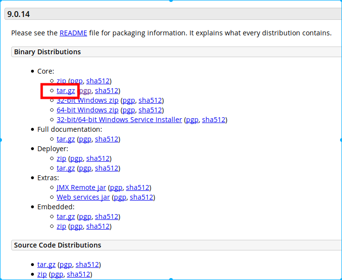

### jdk8安装

#### 1. 使用安装包安装

**官方下载对应的.gz包，这里以jdk-8u231-linux-x64.tar.gz为例** :  **[JDK官网下载地址](https://www.oracle.com/technetwork/java/javase/downloads/jdk8-downloads-2133151.html)**

##### 1.1创建一个目录用于存放解压后的文件，并解压缩到该目录下

```shell
sudo mkdir /usr/lib/jvm
sudo tar -zxvf jdk-8u181-linux-x64.tar.gz -C /usr/lib/jvm
```

##### 1.2修改环境变量

```shell
sudo vim ~/.bashrc
```

##### 1.3文件末尾追加如下内容

```shell
#set oracle jdk environment
export JAVA_HOME=/usr/lib/jvm/jdk1.8.0_231  ## 这里要注意目录要换成自己解压的jdk 目录
export JRE_HOME=${JAVA_HOME}/jre  
export CLASSPATH=.:${JAVA_HOME}/lib:${JRE_HOME}/lib  
export PATH=${JAVA_HOME}/bin:$PATH  

```

##### 1.4使环境变量生效

```shell
source ~/.bashrc
```

##### 1.5设置默认jdk

```shell
sudo update-alternatives --install /usr/bin/java java /usr/lib/jvm/jdk1.8.0_181/bin/java 300  
sudo update-alternatives --install /usr/bin/javac javac /usr/lib/jvm/jdk1.8.0_181/bin/javac 300  
sudo update-alternatives --install /usr/bin/jar jar /usr/lib/jvm/jdk1.8.0_181/bin/jar 300   
sudo update-alternatives --install /usr/bin/javah javah /usr/lib/jvm/jdk1.8.0_181/bin/javah 300   
sudo update-alternatives --install /usr/bin/javap javap /usr/lib/jvm/jdk1.8.0_181/bin/javap 300 

```

##### 1.6执行

```shell
sudo update-alternatives --config java
```

##### 1.7测试是否安装成功

```shell
java -version

javac -version
```

#### 2. 使用ppa(源)方式安装

##### 2.1添加ppa源

```shell
sudo add-apt-repository ppa:webupd8team/java

sudo apt-get update
```

##### 2.2安装oracle-java-installer（jdk8版本）

```shell
sudo apt-get install oracle-java8-installer
```

注：安装器会提示是否同意条款，根据提示选择yes即可，若不想手动输入，则可以采用以下方式自动完成：

```shell
echo oracle-java8-installer shared/accepted-oracle-license-v1-1 select true | sudo /usr/bin/debconf-set-selections
```

##### 2.3设置默认的jdk，可以安装多个jdk版本

```shell
sudo update-java-alternatives -s java-8-oracle
```

##### 2.4测试jdk是否安装成功

```shell
java -version

javac -version
```


### tomcat安装

##### 1.下载

进入网址：https://tomcat.apache.org/download-90.cgi   ， 下载红框中的内容

 

##### 2. 解压

```shell
sudo tar -zxvf apache-tomcat-9.0.30.tar.gz -C /usr/lib/jvm
```

##### 3. 更改读写权限

```shell
sudo chmod -R 777 /usr/lib/jvm/
```

##### 4. 配置环境变量

```shell
# 编辑
sudo gedit /usr/lib/jvm/apache-tomcat-9.0.30/bin/startup.sh

# 接着在最后一行的前面添加以下内容(注意：不是最后一行)
# 内容如下：
# 前四行是java的环境变量
export JAVA_HOME=/usr/lib/jvm/jdk1.8.0_231
export JRE_HOME=${JAVA_HOME}/jre 
export CLASSPATH=.:${JAVA_HOME}/lib:${JRE_HOME}/lib 
export PATH=.:${JAVA_HOME}/bin:$PATH

export TOMCAT_HOME=/usr/lib/jvm/

```

##### 启动

```shell
/usr/lib/jvm/apache-tomcat-9.0.30/bin/startup.sh
```

启动成功如下


