## 选择

### Windows篇

阿里云提供了6种window系统，涵盖了Server 2003 sp2以及Server 2008 R2这两大类操作系统。其中又分为了32位和64位

#### （1）如何选择32位还是64位

32位系统相比64位系统，最主要的限制体现在内存的大小上。因为32位本身的限制，其最大只可支持到4GB内存，如果您的网站要使用高于4GB的内存或者以后有扩充内存寻到4GB以上的打算，请使用64位操作系统。

脚本之家小编建议：想安装64位系统且大于8g的配置就选择2008 r2 ，选择2003一般都是32位的

#### （2）选择2003还是选择2008

对于windows来说，我个人建议是选择版本越高的越好。相对来说新版本漏洞相对来说更少，而且IIS 7.5相对于IIS6提供了更多的功能以及更方便的控制台。但是考虑到大家的机器配置不同，在此给出一下几种选择：

配置低于双核 2GB内存：选择server2003 不装数据库
配置双核4GB： server 2003 mssql 或者 server 2008 R2 不带数据库
配置高于双核 8GB：serever 2008 R2(win2012/2016) mssql

建议如果大家要在云服务器上跑数据库，尽量选择大内存配置，或者降低配置去选用RDS，也可以购买云数据库。

#### （3）中英文、安全加固版如何选择

这个就依据大家各自的喜好来了，在此不多说了

至于Windows服务器配置教程，因为网上教程很多而且相对于Linux来说Windows配置难度更低，所以Windows的配置教程会比较晚的放出。

### Linux篇

这个是本篇教程的重点，叫大家如何来选择Linux服务器。

Linux阿里云提供了两大类共11种，下面让我们来介绍具体的区别。

#### （1）这些Linux版本有什么区别？

Linux按照大类来分，阿里云提供了基于Debian跟Red Hat两大类操作系统，具体分类如下：

Debian：Ubuntu，Debian
Red hat：Red Hat ，Centos

#### （2）这两大类有什么区别

Debian：用的deb包，使用APT包管理系统。同时Debian提供了大多数软件比较新的版本，并且提供了更多的软件包（相对于原版Red Hat）。Debian的优点在于更新迅速，软件包完善（Ubuntu尤其），操作便利。缺点是部分时候稳定性欠佳，跟进最新软件有可能存在Bug。

Red Hat：用rpm包，使用yum包管理系统。相对于Debian来说，Red Hat的一大特点就是慢。大部分软件停留在稳定版本，而且相距最新版版本也差较多。而且某些新版软件的一些新特性支持也比较慢，比如php-fpm。因为Red Hat是面向企业用户提供的操作系统，所以在稳定性上十分突出，一般在新功能或稳定性的选择上更倾向于后者。只有当某个功能完全确定稳定了，才会加入到系统里。优点是系统稳定，技术文档完善，如果付费的话能得到企业级别的技术支持。缺点是软件包比较老旧，而且一些较新功能会欠缺。

总结一下：
如果你喜欢尝鲜，喜欢用最新的功能或喜欢折腾系统，那么Debian是个更好的选择。相对于Red Hat的内核还停留在2.6，Debian早已迈入3.0大门。

如果你追求稳定，不想经常升级系统软件不爱折腾，那么Red Hat是你更好的选择，出色的稳定性以及丰富的文档支持一定可以满足你的需要，当然太新的功能不要抱有幻想。而且Red Hat完善的文档可以免去你到处查找教程、论坛之苦

上手难度 Ubunt<Debian<Redhat=Centos

#### （3）Debian与Ubuntu的选择

Ubuntu是基于Debian所开发，可以简单地认为Ubuntu是Debian的功能加强版。与Debian相比，Ubuntu提供了更人性化系统配置，更强大的系统操作以及比Debian更激进的软件更新。Ubuntu与Debian比较，可以认为Debian更趋向于保守一些，Ubuntu对新手友好度更高，上手更容易。用过Ubuntu的都会体会到它的易用，反之如果用过Ubuntu再换到别的系统，都会觉得不适应，Ubuntu真的很方便。

个人建议，如果你打算选择Debian类的，建议选择Ubuntu。Ubuntu提供了更好的操作，更激进的软件更新，更方便管理软件以及相差无几的稳定性。如果你想用Debian类，不想放弃稳定，那么请选择Debian。与Ubuntu相比Debian的稳定性更佳，但是也就存在了Red Hat与Debian相比类似的问题。

##### 关于Ubuntu版本选择：

Debian就给了一个版本，就不说什么了，重点说一下Ubuntu。

不知道阿里云工程师当初怎么想到的还是他自己做镜像时候用的10.10，竟然有10.10？

在此解释下Ubuntu的版本支持时间。Ubuntu普通版本只提供18个月的技术支持，过期则不管。LTS服务器版本提供长达五年的技术支持。Ubuntu 10.10是个普通版，现在已经过了支持周期了。如果你用了，很好，你会发现你安装不了任何软件，10.10的软件已经从Ubuntu软件源中被移除了。所以建议大家选择12.04 LTS版，提供长达5年的技术支持，可以确保在静候相当长的一段时间内你的服务器可以继续收到系统升级补丁以及可用的软件源。顺便再吐槽一下制作这个ISO的，能不能有点专业精神啊！给个没软件源的让我们装完了放那里看么？

#### (4) Red Hat和Centos 选择

Red Hat跟Centos就没那么多差别了。

Red Hat是付费操作系统，你可以免费使用，但是如果要使用Red Hat的软件源并且想得到技术支持的话，是要像Windows那样掏钱的，所以大家可以理解为Linux中的Windows。这么做符合开源精神，免费使用，服务收费。
Centos是Red Hat的开源版本。一般在Red Hat更新之后，Centos会把代码中含有Red Hat专利的部分去掉，同时Red Hat中包含的种种服务器设置工具也一起干掉，然后重新编译就是Centos。

从某种意义上说，Centos几乎可以完完全全看成是Red Hat，这两个版本的rpm包都是可以通用的。

那么这样问题就简单了

如果你舍得花钱买技术支持，并且想得到完善的技术服务，请去买Red Hat的授权，你会得到如Windows一般强大的技术支持的。

如果你只想用，什么付费技术支持什么专有软件都是浮云，那么用Centos吧。

Centos 5 对应 Red Hat 5
Centos 6 对应 Red Hat 6（阿里云没提供这个版本）

centos 7 (不建议生产环境，就是正式跑网站不建议用)

同时Red Hat技术支持的文档也是同样可以套用在Centos上的，命令都不用改（毕竟本质上来说一样么）。

Red Hat系的最大特点就是稳定。因为Centos需要在Red Hat更新后才能更新，所以一般补丁更新速度要落后于Red Hat，当然这个对大多数人来说等一段时间不是什么大问题。

Red Hat是对Linux内核代码贡献度第一的公司，2012年统计Red Hat贡献了超过10%的代码，所以Red Hat可以说是当前最稳定的Linux版本。Centos秉承Red Hat良好的衣钵，也有一流的稳定性，这点是Debian所无法比拟的。同样团建更新速度Red Hat会慢很多很多，但是一旦更新的话就是稳定版本，稳定性压倒一切。

对于阿里云Centos的选择，建议选择Centos 6.3版本，带来了更多的新特性以及更多的新功能。

除非你的软件需要php 5.1的环境，那么就选择Centos6.3。如果网站需要支持php5.1，只能选用Centos 5。

至于具体版本选择，建议php 5.1用户选择Centoss 5.8，其他的用户则为Centos 6.3

另：想用Nginx也请使用Centos 6.3或以上版本。
小编已经决定用Centos 6.3了，然后搭建Nginx+php+mysql的环境了。

#### 配置服务器是用CentOS6还是用CentOS7

Centos7的变化相对以前版本有点大，需要一段时间重新适应，所以推荐centos6。你的纠结其实很多时候都不是什么问题。


## Ubuntu16.04软件安装

### 修改镜像源

#### 操作流程

打开文件：`vim /etc/apt/sources.list`

替换默认的`http://archive.ubuntu.com/`为`mirrors.aliyun.com`

配置：（Ubuntu16.04）

```
deb http://mirrors.aliyun.com/ubuntu/ xenial main
deb-src http://mirrors.aliyun.com/ubuntu/ xenial main

deb http://mirrors.aliyun.com/ubuntu/ xenial-updates main
deb-src http://mirrors.aliyun.com/ubuntu/ xenial-updates main

deb http://mirrors.aliyun.com/ubuntu/ xenial universe
deb-src http://mirrors.aliyun.com/ubuntu/ xenial universe
deb http://mirrors.aliyun.com/ubuntu/ xenial-updates universe
deb-src http://mirrors.aliyun.com/ubuntu/ xenial-updates universe

deb http://mirrors.aliyun.com/ubuntu/ xenial-security main
deb-src http://mirrors.aliyun.com/ubuntu/ xenial-security main
deb http://mirrors.aliyun.com/ubuntu/ xenial-security universe
deb-src http://mirrors.aliyun.com/ubuntu/ xenial-security universe
```

> 需要注意的是，新增源里的 `xenial` 需要和我们要修改的系统的codename一致。(默认Ubuntu即为 `xenial` ，一般可忽略)。			使用lsb_release -a可以看到codename。

更新源 `sudo apt-get update`

更新已安装的包  `sudo apt-get upgrade`

#### 阿里开源镜像网站：https://developer.aliyun.com/mirror

#### Ubuntu软件操作的相关命令

```shell
sudo apt-get update  更新源

sudo apt-get upgrade 更新已安装的包
 
sudo apt-get install package 安装包
 
sudo apt-get remove package 删除包
 
sudo apt-cache search package 搜索软件包
 
sudo apt-cache show package  获取包的相关信息，如说明、大小、版本等
 
sudo apt-get install package --reinstall   重新安装包
 
sudo apt-get -f install   修复安装
 
sudo apt-get remove package --purge 删除包，包括配置文件等
 
sudo apt-get build-dep package 安装相关的编译环境
 
sudo apt-get dist-upgrade 升级系统

sudo apt-cache depends package 了解使用该包依赖那些包
 
sudo apt-cache rdepends package 查看该包被哪些包依赖
 
sudo apt-get source package  下载该包的源代码
 
sudo apt-get clean && sudo apt-get autoclean 清理无用的包
 
sudo apt-get check 检查是否有损坏的依赖
```


### ifconfig安装

```shell
先更新软件包
sudo apt-get update
sudo apt-get upgrade

安装网络工具包
sudo apt install net-tools

```


### 安装python3.7

#### 安装

##### 直接安装

直接安装：`apt-get install python3.7`

##### 手动安装

若直接安装失败，手动安装。

> 源码的安装一般由3个步骤组成：配置（configure）、编译（make）、安装（make install）。
> configure是一个可执行脚本，它有很多选项，使用命令./configure --help输出详细的选项列表。最常用的参数是 --prefix=目录，这个目录就是软件最后的安装目录。

1. 下载官网安装包：`wget https://www.python.org/ftp/python/3.7.3/Python-3.7.3.tgz`

2. 解压安装包： `tar -zxvf Python-3.7.3.tgz`

3. 配置：

    ```shell
    cd Python-3.7.3
    ./configure	# 建议
    # 或者
    ./configure --prefix=/usr/local/python3.7.3
    ```

4. 编译：`make`             （没有安装make的安装一下）

5. 安装make：`sudo make install`

    > 若步骤3执行的是 ./configure，则安装后可执行文件默认放在/usr /local/bin，库文件默认放在/usr/local/lib，配置文件默认放在/usr/local/include，其它的资源文件放在/usr /local/share。
    >
    > 若步骤3执行的是./configure --prefix=/usr/local/python3.7.3，则可执行文件放在/usr /local/python3.7.3/bin，库文件放在/usr/local/python3.7.3/lib，配置文件放在/usr/local/python3.7.3/include，其它的资源文件放在/usr /local/python3.7.3/share

6. 环境变量

    若步骤3执行./configure --prefix=/usr/local/python3.7.3，则需要添加环境变量。步骤3是./configure的跳过此步骤。

    添加环境变量： `PATH=$PATH:$HOME/bin:/usr/local/python3.7.3/bin`
    查看环境变量： `echo $PATH`

#### 默认指向

查看python的指向： `ls -l /usr/bin | grep python`

删除原有链接： `rm /usr/bin/python` 

若python3.7安装时，执行的是./configure，则：

```shell
mv /usr/bin/python /usr/bin/python.bak
ln -s /usr/local/bin/python3 /usr/bin/python
mv /usr/bin/pip /usr/bin/pip.bak
ln -s /usr/local/bin/pip3 /usr/bin/pip

```

若python3.7安装时，执行的是./configure --prefix=/usr/local/python3.7.1，为：

```shell
mv /usr/bin/python /usr/bin/python.bak
ln -s /usr/local/python3.7.1/bin/python3.7 /usr/bin/python
mv /usr/bin/pip /usr/bin/pip.bak
ln -s /usr/local/python3.7.1/bin/pip3 /usr/bin/pip

```


### svn安装

#### 执行如下命令进行安装

```
apt-get install subversion
```

如果出现如下提示，则处理方法如下:


```shell
# 执行命令
ps -e|grep apt-get
# 查看进程
sudo netstat -ntlp

6965 ?        00:00:01 apt-get  #显示

# 如果存在进程，则直接杀死。
kill 6965

# 如果执行ps -e|grep apt-get 无任何显示的时候，需要执行如下命令:
sudo rm /var/cache/apt/archives/lock  
sudo rm /var/lib/dpkg/lock

```

#### 查看svn安装版本

```
svn --version
```

#### 配置和测试使用

##### 建立SVN仓库目录

```shell
mkdir -p /home/svn/project
cd /home
chmod -R 777 svn/
```

此时svn以及project文件夹全部为drwxrwxrwx

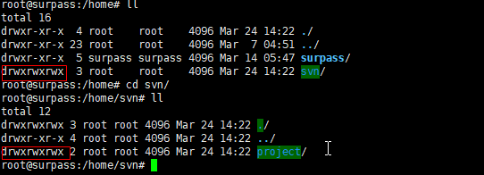

##### 创建初始化仓库

``` shell
svnadmin create /home/svn/project
```

此时查看project路径下的文件

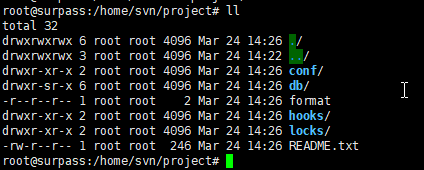

##### 设置访问权限

进入conf/svnserve.conf，执行如下命令

```shell
cd /home/svn/project/conf
vim svnserve.conf
```

打开anon-access = read，auth-access = write。anon-access无需账户可以read，auth-access验证用户可以write.分别为配置文件的19、20、27行。将前面的#取掉。

> 其中 anon-access 和 auth-access 分别为匿名和有权限用户的权限，默认给匿名用户只读的权限，这很好，我们不需要改它们。但如果想拒绝匿名用户的访问，只需把 read 改成 none 就能达到目的。password-db 后的 passwd 则为定义用户名及密码的文件路径。这个文件默认跟 snvserve.conf 在同一个目录。

 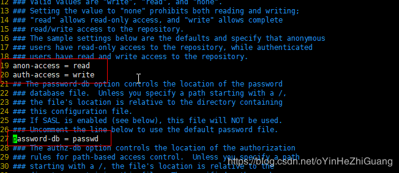

##### 增加用户和设置密码

编辑配置文件/home/svn/project/conf/passwd

harry 和 sally 这两行分别定义了可以对 repo 进行写入的用户的用户名和密码。我们可以在下面加上自己的用户名和密码，比如，`surpass = 123456`  其中 surpass 是用户名，123456 是密码


#### 启动svn服务端

通过svnserve命令启动svn服务端，可以使用以下参数

-d 以守护进程的方式后台启动程序

-r  指定启动使用的仓库地址 这样客户端不用输入全路径，就可以访问版本库。如：svn://192.168.10.101/project

启动之后，可以通过查看进程（ps）的方式，检查服务是否启动


其他选项

```shell
# --listen -port 端口
svnserve -d -r /home/svn/ --listen-port 21   # 不要加端口，之前ftp也用了21端口。 可能发生了冲突， 但是查看所有端口并不能发下21端口被占用，奇怪的问题

```

##### 设置自启

https://zhuanlan.zhihu.com/p/56020157

https://blog.djinguo.com/2019-01-30/ubuntu-18-start/

#### 关闭svn服务

```shell
killall svnserve
```

#### 查看进程

```shell
# 查看所有进程
sudo netstat -ntlp
# 查看svn服务
ps -A|grep svn
ps aux|grep svnserve 	# 优选
```


### 上传文件到远程

安装lrzsz

```shell
# 安装包
sudo apt-get install lrzsz
# 从远端下载
sz 文件
# 上传到远端
rz

```


### 将Ubuntu中文目录改为英文

#### 方法一

打开终端，在终端中输入命令:

```shell
export LANG=en_US
xdg-user-dirs-gtk-update

```

跳出对话框询问是否将目录转化为英文路径,同意并关闭。
在终端中输入命令:

```shell
export LANG=zh_CN
```

重新启动系统，系统会提示更新文件名称，选择不再提示,并取消修改。

#### 方法二

编辑~/.config/user-dirs.dirs文件

```shell
vim ~/.config/user-dirs.dirs
```

修改文件内容为：

```shell
XDG_DESKTOP_DIR="$HOME/Desktop"
XDG_DOWNLOAD_DIR="$HOME/Downloads"
XDG_TEMPLATES_DIR="$HOME/Templates"
XDG_PUBLICSHARE_DIR="$HOME/Public"
XDG_DOCUMENTS_DIR="$HOME/Documents"
XDG_MUSIC_DIR="$HOME/Music"
XDG_PICTURES_DIR="$HOME/Pictures"
XDG_VIDEOS_DIR="$HOME/Videos"

```

#### 方法三

打开 系统设置-》语言支持 将“english”拖动到最上端，重启系统。
重启后，会提示更新文件名称，更新后在将语言”中文“拖动到顶部，重启系统 。


### jdk8安装

#### 1. 使用安装包安装

**官方下载对应的.gz包，这里以jdk-8u231-linux-x64.tar.gz为例** :  **[JDK官网下载地址](https://www.oracle.com/technetwork/java/javase/downloads/jdk8-downloads-2133151.html)**

##### 1.1创建一个目录用于存放解压后的文件，并解压缩到该目录下

```shell
sudo mkdir /usr/lib/jvm
sudo tar -zxvf jdk-8u181-linux-x64.tar.gz -C /usr/lib/jvm
```

##### 1.2修改环境变量

```shell
sudo vim ~/.bashrc
```

##### 1.3文件末尾追加如下内容

```shell
#set oracle jdk environment
export JAVA_HOME=/usr/lib/jvm/jdk1.8.0_231  ## 这里要注意目录要换成自己解压的jdk 目录
export JRE_HOME=${JAVA_HOME}/jre  
export CLASSPATH=.:${JAVA_HOME}/lib:${JRE_HOME}/lib  
export PATH=${JAVA_HOME}/bin:$PATH  

```

##### 1.4使环境变量生效

```shell
source ~/.bashrc
```

##### 1.5设置默认jdk

```shell
sudo update-alternatives --install /usr/bin/java java /usr/lib/jvm/jdk1.8.0_181/bin/java 300  
sudo update-alternatives --install /usr/bin/javac javac /usr/lib/jvm/jdk1.8.0_181/bin/javac 300  
sudo update-alternatives --install /usr/bin/jar jar /usr/lib/jvm/jdk1.8.0_181/bin/jar 300   
sudo update-alternatives --install /usr/bin/javah javah /usr/lib/jvm/jdk1.8.0_181/bin/javah 300   
sudo update-alternatives --install /usr/bin/javap javap /usr/lib/jvm/jdk1.8.0_181/bin/javap 300 

```

##### 1.6执行

```shell
sudo update-alternatives --config java
```

##### 1.7测试是否安装成功

```shell
java -version

javac -version
```

#### 2. 使用ppa(源)方式安装

##### 2.1添加ppa源

```shell
sudo add-apt-repository ppa:webupd8team/java

sudo apt-get update
```

##### 2.2安装oracle-java-installer（jdk8版本）

```shell
sudo apt-get install oracle-java8-installer
```

注：安装器会提示是否同意条款，根据提示选择yes即可，若不想手动输入，则可以采用以下方式自动完成：

```shell
echo oracle-java8-installer shared/accepted-oracle-license-v1-1 select true | sudo /usr/bin/debconf-set-selections
```

##### 2.3设置默认的jdk，可以安装多个jdk版本

```shell
sudo update-java-alternatives -s java-8-oracle
```

##### 2.4测试jdk是否安装成功

```shell
java -version

javac -version
```

##### 添加环境变量

·······打开 `vim /etc/profile`，添加

```
export PATH USER LOGNAME MAIL HOSTNAME HISTSIZE HISTCONTROL
export JAVA_HOME=/usr/local/zdyg/jdk1.8.0_231
export CLASSPATH=./$CLASSPATH:$JAVA_HOME/lib:$JAVA_HOME/jre/lib
export PATH=$JAVA_HOME/bin:$JAVA_HOME/jre/bin:$PATH:$HOME/bin
export JRE_HOME=$JAVA_HOME/jre
export CATALINA_HOME=/usr/local/zdyg/apache-tomcat-9.0.30
export JAVA_BIN=$JAVA_HOME/bin

```

重启配置文件

```shell
source /etc/profile
```


### tomcat安装

##### 1.下载

进入网址：https://tomcat.apache.org/download-90.cgi   ， 下载红框中的内容

 

##### 2. 解压

```shell
sudo tar -zxvf apache-tomcat-9.0.30.tar.gz -C /usr/lib/jvm
```

##### 3. 更改读写权限

```shell
sudo chmod -R 777 /usr/lib/jvm/
```

##### 4. 配置环境变量

```shell
# 编辑
sudo gedit /usr/lib/jvm/apache-tomcat-9.0.30/bin/startup.sh

# 接着在最后一行的前面添加以下内容(注意：不是最后一行)
# 内容如下：
# 前四行是java的环境变量
export JAVA_HOME=/usr/lib/jvm/jdk1.8.0_231
export JRE_HOME=${JAVA_HOME}/jre 
export CLASSPATH=.:${JAVA_HOME}/lib:${JRE_HOME}/lib 
export PATH=.:${JAVA_HOME}/bin:$PATH

export TOMCAT_HOME=/usr/lib/jvm/

```

##### 启动

```shell
/usr/lib/jvm/apache-tomcat-9.0.30/bin/startup.sh
```

启动成功如下


### Mysql安装

#### 1. 安装方案

1. 转到位于https://dev.mysql.com/downloads/repo/apt/的MySQL APT存储库的下载页面 ，选择并下载适用于Linux发行版的发行包。

    > 注意：在软件包安装过程中，系统会提示您选择 MySQL 服务器版本和其他组件，例如群集、共享客户端库或配置要安装 MySQL 的工作台。

2. 默认 MySQL 服务器版本 mysql-8.0 的源将被自动选中，我们只需最终确定就可以完成发行包的配置和安装。

    安装执行，选择MySQL8.0，OK。

    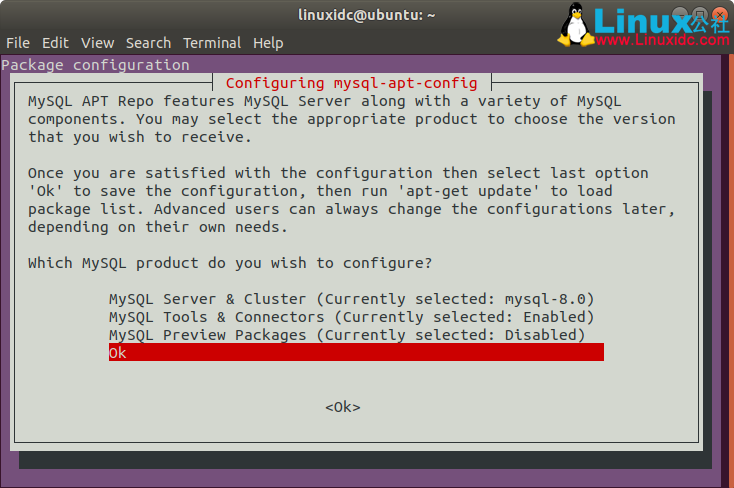

3. 然后  `sudo apt update`  一下

    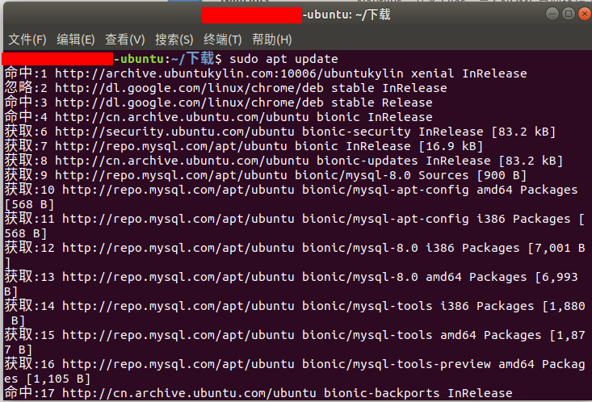

4. 使用**sudo apt install mysql-serve**r命令，就会安装MySQL8.0

    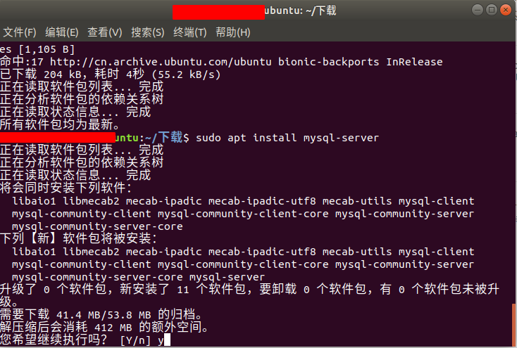

5. 按此方法会在安装过程中出现如下[界面](https://www.baidu.com/s?wd=界面&tn=24004469_oem_dg&rsv_dl=gh_pl_sl_csd)要求用户输入MySQL密码(要输入两次，第二次确认密码)

    

6. **MySQL8.0采用了新的加密方式，一定要注意，正是因为这个加密方式才导致Ubuntu18.04用设置的root密码登录不了MySQL，因为Ubuntu18.04的终端可能有问题，并不支持这个新的加密方式。幸好有界面可以让我们选择使用旧版本5.x的加密方式，所以果断选择采用5.x的加密方式。**

    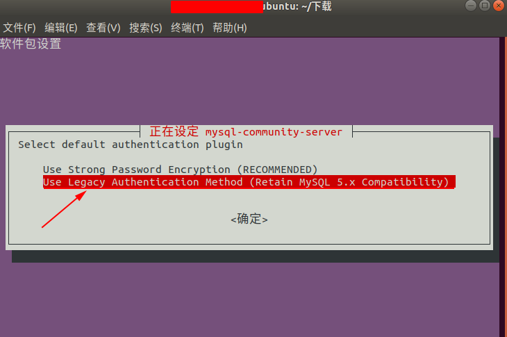

7. 最后在终端输入mysql -u root -p命令并输入密码检查安装成功而且可以看到MySQL版本号为8.0！！

    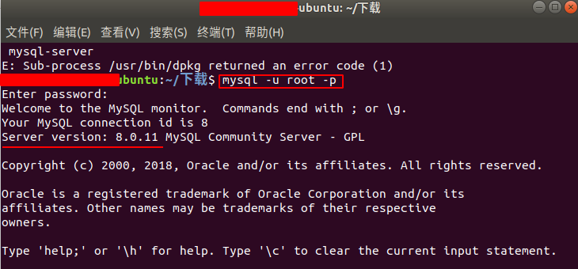

#### 2. 官方文档

**全新安装MySQL的步骤**：**[官方网址](https://dev.mysql.com/doc/mysql-apt-repo-quick-guide/en/#apt-repo-fresh-install)** 

> 以下说明假定您的系统上尚未安装MySQL的任何版本（无论是由Oracle还是其他方分发）；如果不是这种情况，请按照[使用MySQL APT存储库](https://dev.mysql.com/doc/mysql-apt-repo-quick-guide/en/index.html#repo-qg-apt-replacing)[替换MySQL的](https://dev.mysql.com/doc/mysql-apt-repo-quick-guide/en/index.html#repo-qg-apt-replace-direct)[本机发行版](https://dev.mysql.com/doc/mysql-apt-repo-quick-guide/en/index.html#repo-qg-apt-replacing)或 [替换直接deb程序包下载安装的MySQL服务器中](https://dev.mysql.com/doc/mysql-apt-repo-quick-guide/en/index.html#repo-qg-apt-replace-direct)给出的说明进行操作 

##### 1. 添加MySQL APT存储库

1. 转到位于https://dev.mysql.com/downloads/repo/apt/的MySQL APT存储库的下载页面 。

2. 选择并下载适用于Linux发行版的发行包。

3. 使用以下命令安装下载的发行软件包，并用*`version-specific-package-name`* 下载的软件包的名称替换 （如果不在软件包所在的文件夹中运行该命令，则以其路径开头）：

    ```terminal
    shell> sudo dpkg -i /PATH/version-specific-package-name.deb
    ```

    

    例如，对于*`w.x.y-z`*软件包的版本 ，命令为：

    ```shell
    sudo dpkg -i mysql-apt-config_w.x.y-z_all.deb
    ```

    请注意，相同的软件包可在所有受支持的Debian和Ubuntu平台上使用。

4. 在安装软件包的过程中，将要求您选择要安装的MySQL服务器和其他组件（例如MySQL Workbench）的版本。如果不确定要选择哪个版本，请不要更改为您选择的默认选项。 如果您不想安装特定的组件，也可以**不**选择**任何**一个。在为所有组件做出选择之后，选择**确定**以完成发行包的配置和安装。

    以后，您随时可以更改选择。 有关说明，请参见[选择主要发行版本](https://dev.mysql.com/doc/mysql-apt-repo-quick-guide/en/index.html#repo-qg-apt-select-series)。

5. 使用以下命令从MySQL APT存储库更新软件包信息（*此步骤为必需步骤*）：

    ```shell
    sudo apt-get update
    ```

除了使用发行包之外，您还可以手动添加和配置MySQL APT存储库。有关详细信息，请参见 [附录A：手动添加和配置MySQL APT存储库](https://dev.mysql.com/doc/mysql-apt-repo-quick-guide/en/index.html#repo-qg-apt-repo-manual-setup)。

> 注意
>
> 一旦在系统上启用了MySQL APT存储库，在禁用MySQL APT存储库之前，您将不再能够从平台的本机软件存储库安装任何MySQL软件包。

##### 2. 使用APT安装MySQL

通过以下命令安装MySQL：

```terminal
shell> sudo apt-get install mysql-server
```

这将安装用于MySQL服务器的软件包，以及用于客户端和数据库公用文件的软件包。

在安装过程中，要求您为root用户提供密码以进行MySQL安装。

> 重要
>
> 确保记住设置的根密码。以后想要设置密码的用户可以在对话框中将“ **密码”**字段留空，然后按“ **确定”**。在这种情况下，对服务器的根访问将通过 [Socket Peer-Credential Pluggable Authentication](https://dev.mysql.com/doc/refman/8.0/en/socket-pluggable-authentication.html)进行[身份验证，](https://dev.mysql.com/doc/refman/8.0/en/socket-pluggable-authentication.html)以使用Unix套接字文件进行连接。您可以稍后使用程序**[mysql_secure_installation](https://dev.mysql.com/doc/refman/8.0/en/mysql-secure-installation.html)**设置root密码 。

##### 3. 启动和停止MySQL服务器

安装后，MySQL服务器将自动启动。您可以使用以下命令检查MySQL服务器的状态：

```terminal
shell> sudo service mysql status
```

使用以下命令停止MySQL服务器：

```terminal
shell> sudo service mysql stop
```

要重启MySQL服务器，使用以下命令：

```terminal
shell> sudo service mysql start
```

> 注意
>
> 一些依赖于本机MySQL软件包的第三方本机存储库软件包可能无法与MySQL APT存储库软件包一起使用，因此不应与它们一起使用。这些包括akonadi-backend-mysql，handlersocket-mysql-5.5和zoneminder。

#### 3. 权限设置

##### 查询用户及权限

```mysql
SELECT User, Host, plugin FROM mysql.user;
```

##### 创建新用户

通过root用户登录之后创建

```mysql
grant all privileges on *.* to testuser@localhost identified by "123456";　　# 创建新用户，用户名为testuser，密码为123456 ；

grant all privileges on *.* to testuser@localhost identified by "123456";　　# 设置用户testuser，可以在本地访问mysql

grant all privileges on *.* to testuser@"%" identified by "123456";　　　# 设置用户testuser，可以在远程访问mysql

flush privileges;　　#  mysql 新设置用户或更改密码后需用flush privileges刷新MySQL的系统权限相关表，否则会出现拒绝访问，还有一种方法，就是重新启动mysql服务器，来使新设置生效
```

##### 设置用户访问数据库权限

```mysql
grant all privileges on test_db.* to testuser@localhost identified by "123456";　　# 设置用户testuser，只能访问数据库test_db，其他数据库均不能访问 ；

grant all privileges on *.* to testuser@localhost identified by "123456";　　# 设置用户testuser，可以访问mysql上的所有数据库 ；

grant all privileges on test_db.user_infor to testuser@localhost identified by "123456";　　# 设置用户testuser，只能访问数据库test_db的表user_infor，数据库中的其他表均不能访问 ；
```

##### 设置用户操作权限

```mysql
grant all privileges on *.* to testuser@localhost identified by "123456" WITH GRANT OPTION;　　# 设置用户testuser，拥有所有的操作权限，也就是管理员 ；

grant select on *.* to testuser@localhost identified by "123456" WITH GRANT OPTION;　　# 设置用户testuser，只拥有【查询】操作权限 ；

grant select,insert on *.* to testuser@localhost identified by "123456";　　# 设置用户testuser，只拥有【查询\插入】操作权限 ；

grant select,insert,update,delete on *.* to testuser@localhost identified by "123456";　　# 设置用户testuser，只拥有【查询\插入】操作权限 ；

REVOKE select,insert ON what FROM testuser;　　# 取消用户testuser的【查询\插入】操作权限 ；
```

##### 设置用户远程访问权限

```mysql
grant all privileges on *.* to testuser@“192.168.1.100” identified by "123456";　　# 设置用户testuser，只能在客户端IP为192.168.1.100上才能远程访问mysql ；
```

##### 关于root用户的访问设置

设置所有用户可以远程访问mysql，修改my.cnf配置文件，将bind-address = 127.0.0.1前面加“#”注释掉，这样就可以允许其他机器远程访问本机mysql了；

```mysql
grant all privileges on *.* to root@"%" identified by "123456";　　　# 设置用户root，可以在远程访问mysql

select host,user from user; 　　# 查询mysql中所有用户权限

# 关闭root用户远程访问权限
delete from user where user="root" and host="%";　　# 禁止root用户在远程机器上访问mysql

flush privileges;　　# 修改权限之后，刷新MySQL的系统权限相关表方可生效　　
```

#### 4. mysql5.7安装

##### 安装

```shell
sudo apt-get install mysql-server
sudo apt-get install mysql-client
```

##### 检查MySQL是否运行

```shell
sudo netstat -tap | grep mysql
```

##### 重启/打开/关闭MySQL的方法是

```shell
sudo service mysql restart/start/stop
```

##### 查看初始用户名和密码

> 使用账号root，无密码 可直接进入mysql

查看一个文件

```shell
sudo cat /etc/mysql/debian.cnf

```

在这个文件里面有着MySQL默认的用户名和用户密码， 最最重要的是：用户名默认的不是root，而是debian-sys-maint，如下所示

```
# Automatically generated for Debian scripts. DO NOT TOUCH!
[client]
host     = localhost
user     = debian-sys-maint
password = skFz7zS0Fl1t2QHK
socket   = /var/run/mysqld/mysqld.sock
[mysql_upgrade]
host     = localhost
user     = debian-sys-maint
password = skFz7zS0Fl1t2QHK
socket   = /var/run/mysqld/mysqld.sock

```

记下这里的 ***user*** 和 ***password***，然后到终端里输入 `mysql -u debian-sys-maint -p`，随即会让我们输入密码，此时输入我们刚才记下的密码即可进入 mysql 的shell环境了。

##### 更改访问账户密码

```mysql
update mysql.user set authentication_string=password('password') where user='root'and Host = 'localhost';
```

> Tips:这里说明下，在 MySQL 5.7 password字段已从`mysql.user`表中删除，新的字段名是`authenticalion_string`。

然后你以为在终端输入`mysql -u root -p`，然后再输入你刚才设置的密码就可以访问了吗？

天真，怎么会那么简单，想要成长，怎么能不被无情的现实蹂躏一番。


可我明明就已经改过密码了，为啥还是登陆不进去。

于是我又开始在度娘上搜索，终于找到了问题的原因：

> 原因是因为在最近的Ubuntu安装（当然也可能是其他安装）中，MySQL默认使用了`UNIX auth_socket plugin`插件。
>
> 简单来说这意味着当`db_users`使用数据库时，**将会通过系统用户认证表进行认证**。

你可以通过下面的命令看看你的root用户是否设置成了这样：

```mysql
mysql> USE mysql;
mysql> SELECT User, Host, plugin FROM mysql.user;

+------------------+-----------------------+
| User             | plugin                |
+------------------+-----------------------+
| root             | auth_socket           |
| mysql.sys        | mysql_native_password |
| debian-sys-maint | mysql_native_password |
+------------------+-----------------------+

```

如果是这样的话就说明root用户正在使用`auth_socket`插件，对于这种问题，有两种解决方案：

1. **设置你的root用户使用 mysql_native_password 插件**
2. **创建一个与你的系统用户一致的新的数据库用户（推荐）**

##### 设置 root 用户使用 mysql_native_password 插件

因为不推荐采用这种方式，所以这里只是给出要执行的命令：

```
mysql> USE mysql;
mysql> UPDATE user SET plugin='mysql_native_password' WHERE User='root';
mysql> FLUSH PRIVILEGES;
mysql> exit;
```

##### 创建一个新用户

重点来说下这种方式。之所以要新建一个用户，不单单是为了解决修改root账户密码的情况。我们知道，当一个项目的体量上去了，数据库的维护就变得非常重要了，如果发展到一定程度后用户名仍然是root（如果这时候还开通了外网访问），那安全性就会大大降低。况且每个项目的开发人员肯定不止一个，不同coder的权限等级也不一样，能对数据库进行的操作肯定也是不一样的。所以综上所述，我依旧推荐在刚开始安装mysql时就新建一个用户进行配置。

**命令：**

```
CREATE USER 'username'@'host' IDENTIFIED BY 'password';
复制代码
```

**说明：**

- username：你将创建的用户名
- host：指定该用户在哪个主机上可以登陆，如果是本地用户可用localhost，如果想让该用户可以**从任意远程主机登陆**，可以使用通配符`%`
- password：该用户的登陆密码，密码可以为空，如果为空则该用户可以不需要密码登陆服务器

**举例：**

如果我想创建一个用户名为"lyy"，密码为123456，且**允许从任意远程主机登陆**，可以执行下面这条命令：

```
CREATE USER 'lyy'@'%' IDENTIFIED BY '123456';
复制代码
```

##### 给新创建的用户授权

**命令：**

```
GRANT privileges ON databasename.tablename TO 'username'@'host'
复制代码
```

**说明：**

- privileges：用户的操作权限，如`SELECT`，`INSERT`，`UPDATE`等，如果要授予所的权限则使用`ALL`
- databasename：数据库名
- tablename：表名，如果要授予该用户对所有数据库和表的相应操作权限则可用`*`表示，如`*.*`

**例子：**

```
GRANT SELECT, INSERT ON test.user TO 'lyy'@'%';
GRANT ALL ON *.* TO 'lyy'@'%';
复制代码
```

这样我们在回到shell环境中，执行`mysql -u lyy -p`然后输入密码就可以进入mysql的shell环境了。

> Tips：如果想要更新某个用户的密码只需要执行：
>
> ```
> update user set authentication_string=password('password') where user='username' and host='host';
> 复制代码
> ```

##### 设置 mysql 可以外网访问

在使用 mysql 的过程中，我们往往都会使用Navicat等工具对数据库进行可视化管理，这时就需要设置mysql外网访问了。

设置过程分为两步：

1. 设置用户可以**从任意远程主机登陆**
2. 修改配置文件，注释掉 `bind-address`

第一步在上面已经说过了，这里来说下第二步：

mysql 5.7的配置文件路径在：`/etc/mysql/mysql.conf.d/mysqld.cnf`，当我们执行`sudo cat /etc/mysql/mysql.conf.d/mysqld.cnf`命令时结果如下所示：


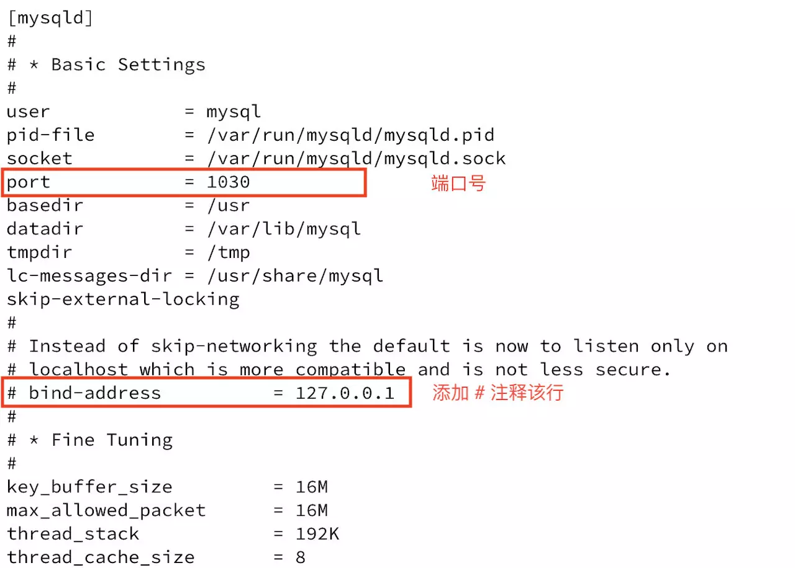


在`bind-address`前添加`#`注释掉该行即可。

> Tips：出于安全考虑，如果我们想要修改mysql的启动端口，可以修改上述图片中的 **port** 部分为自己想要的端口号。

在这一切都弄好之后别忘了重新启动下mysql哦😯

```
sudo service mysql restart
```

#### 5. centos安装mysql

https://www.jianshu.com/p/1dab9a4d0d5f

##### 安装 mysql 源

```shell
# 下载
shell> wget https://dev.mysql.com/get/mysql57-community-release-el7-11.noarch.rpm
# 安装 mysql 源
shell> yum localinstall mysql57-community-release-el7-11.noarch.rpm
```

用下面的命令检查 mysql 源是否安装成功

```shell
shell> yum repolist enabled | grep "mysql.*-community.*"
```

##### 安装 MySQL

使用 yum install 命令安装

```undefined
shell> yum install -y mysql-community-server
```

##### 查看Mysql

```shell
# 启动MySQL
systemctl start mysqld
# 查看 MySQL 状态
systemctl status mysqld
# 重启MySQL
systemctl restart mysqld
```

##### 设置开机启动

```shell
shell> systemctl enable mysqld
# 重载所有修改过的配置文件
shell> systemctl daemon-reload
```

##### 修改 root 本地账户密码

mysql 安装完成之后，生成的默认密码在 `/var/log/mysqld.log` 文件中。使用 grep 命令找到日志中的密码。

```bash
shell> grep 'temporary password' /var/log/mysqld.log
```

登录，修改密码

> 默认密码检查策略要求密码必须包含：大小写字母、数字和特殊符号，并且长度不能少于8位。

```bash
shell> mysql -uroot -p
mysql> ALTER USER 'root'@'localhost' IDENTIFIED BY '密码'; 
```

或者

```mysql
mysql> set password for 'root'@'localhost'=password('密码'); 
```

以后通过 update set 语句修改密码

```mysql
mysql> use mysql;
mysql> update user set password=PASSWORD('密码') where user='root';
mysql> flush privileges;
```

##### 添加远程登录用户

添加一个允许远程连接的帐户

```mysql
mysql> GRANT ALL PRIVILEGES ON *.* TO '用户名'@'%' IDENTIFIED BY '密码' WITH GRANT OPTION;
```

~~修改 root 为允许远程连接~~（不推荐）

```mysql
mysql> use mysql;
mysql> UPDATE user SET Host='%' WHERE User='root';
mysql> flush privileges;
```

##### 设置默认编码为 utf8

mysql 安装后默认不支持中文，需要修改编码。
 修改 `/etc/my.cnf` 配置文件，在相关节点（没有则自行添加）下添加编码配置，如下：

```mysql
[mysqld]
character-set-server=utf8
[client]
default-character-set=utf8
[mysql]
default-character-set=utf8
```

重启mysql服务，查询编码。可以看到已经改过来了

```dart
shell> systemctl restart mysqld
shell> mysql -uroot -p
mysql> show variables like 'character%';
```

#### 6. mysql参数

```
命令：show status like '%下面变量%'; 
Aborted_clients                由于客户没有正确关闭连接已经死掉，已经放弃的连接数量。 
Aborted_connects            尝试已经失败的MySQL服务器的连接的次数。 
Connections                     试图连接MySQL服务器的次数。 
Created_tmp_tables          当执行语句时，已经被创造了的隐含临时表的数量。 
Delayed_insert_threads     正在使用的延迟插入处理器线程的数量。 
Delayed_writes                用INSERT DELAYED写入的行数。 
Delayed_errors                用INSERT DELAYED写入的发生某些错误(可能重复键值)的行数。 
Flush_commands            执行FLUSH命令的次数。 
Handler_delete                 请求从一张表中删除行的次数。 
Handler_read_first          请求读入表中第一行的次数。 
Handler_read_key           请求数字基于键读行。 
Handler_read_next           请求读入基于一个键的一行的次数。 
Handler_read_rnd           请求读入基于一个固定位置的一行的次数。 
Handler_update              请求更新表中一行的次数。 
Handler_write                 请求向表中插入一行的次数。 
Key_blocks_used            用于关键字缓存的块的数量。 
Key_read_requests         请求从缓存读入一个键值的次数。 
Key_reads                      从磁盘物理读入一个键值的次数。 
Key_write_requests         请求将一个关键字块写入缓存次数。 
Key_writes                      将一个键值块物理写入磁盘的次数。 
Max_used_connections    同时使用的连接的最大数目。 
Not_flushed_key_blocks   在键缓存中已经改变但是还没被清空到磁盘上的键块。 
Not_flushed_delayed_rows      在INSERT DELAY队列中等待写入的行的数量。 
Open_tables                  打开表的数量。 
Open_files                     打开文件的数量。 
Open_streams               打开流的数量(主要用于日志记载） 
Opened_tables              已经打开的表的数量。 
Questions                     发往服务器的查询的数量。 
Slow_queries                要花超过long_query_time时间的查询数量。 
Threads_connected       当前打开的连接的数量。 
Threads_running          不在睡眠的线程数量。 
Uptime                        服务器工作了多少秒。
```


### redis安装

#### redis5.0.7安装

##### 下载Redis

```shell
wget https://download.redis.io/releases/redis-5.0.0.tar.gz
```

##### 解压文件

```shell
sudo tar -zxvf redis-5.0.0.tar.gz -C /usr/local
```

##### 安装 make 和 gcc

```shell
sudo apt install make

sudo apt install gcc

```

##### 编译Redis

```shell
cd redis-5.0.0/
sudo make

```

##### 如需测试,需要安装`tcl`

```shell
wget http://downloads.sourceforge.net/tcl/tcl8.6.1-src.tar.gz

sudo cp tcl8.6.1-src.tar.gz /usr/local/
sudo tar -xzvf tcl8.6.1-src.tar.gz

cd  tcl8.6.1/unix/
sudo ./configure

sudo make

sudo make install

cd /usr/local/redis-5.0.0/
sudo make test

```

##### 安装Redis

```shell
sudo make install
```

##### 配置Redis服务

***配置`.conf`文件***

```shell
sudo mkdir /etc/redis/
sudo cp /usr/local/redis-5.0.7/redis.conf /etc/redis/6379.conf
sudo vim /etc/redis/6379.conf
```

***修改`6379.conf`文件***

```
...
bind 0.0.0.0
...
protected-mode no
...
daemonize yes
...
logfile /var/log/redis/redis.log
...
dir /var/lib/redis/
...
# replicaof <masterip> <masterport>
replivaof xxx.xxx.xxx.xxx 6379   # 作为从服务器时,主服务器的IP与端口
# masterauth <master-password>
masterauth password          # 作为从服务器时,主服务器启用redis权限认证设置的密码
...
# requirepass foobared
requirepass password         # 启用redis权限认证,设置的密码

```

##### 配置 Redis 启动脚本

```shell
sudo cp /usr/local/redis-5.0.7/utils/redis_init_script /etc/init.d/redisd
sudo chmod +x /etc/init.d/redisd
```

##### 初始化用户和日志路径

建议为Redis单独建立一个用户，并新建db和日志文件夹

```shell
sudo useradd redis
sudo mkdir -p /var/lib/redis/
sudo mkdir -p /var/log/redis/
sudo chown redis.redis /var/lib/redis/ 
sudo chown redis.redis /var/log/redis/

```

##### 设置开机自动启动，关机自动关闭

```shell
sudo update-rc.d redisd defaults
```

##### 启动Redis

```SHELL
sudo /etc/init.d/redisd start	# 启动
sudo /etc/init.d/redisd stop	# 停止
sudo /etc/init.d/redisd restart  	# 重启
```

#### cenos安装redis5.0.7

参考：https://blog.csdn.net/NathanniuBee/article/details/83274960

##### 下载Redis

```shell
curl https://download.redis.io/releases/redis-5.0.7.tar.gz
```

##### 解压文件

```shell
tar -zxvf redis-5.0.7.tar.gz -C /usr/local
```

##### 安装 make 和 gcc

```shell
yum -y install make

yum -y install gcc

```

###### 安装gcc出现的问题

参考：https://blog.csdn.net/fjx1173865548/article/details/78579923

遇到：[Errno 256] No more mirrors to try  的问题

```
rm -rf /var/cache/yum/*
 
yum clean all

yum repolist

yum -y install make gcc gcc-c++
```

出现下载源没有的情况，在域名服务器配置中，添加一个8.8.8.8，就解决了：

```shell
# vi /etc/resolv.conf

# Generated by NetworkManager
nameserver 8.8.8.8

```

##### 编译Redis

```shell
cd /usr/local
cd redis-5.0.0/
make
cd src
make install
```

###### make不能成功的原因

参考：https://blog.csdn.net/bugall/article/details/45914867

​			https://blog.csdn.net/qq_35673617/article/details/80235836

> 在README 有这个一段话。
>
> 说关于分配器allocator， 如果有MALLOC  这个 环境变量， 会有用这个环境变量的 去建立Redis。而且libc 并不是默认的 分配器， 默认的是 jemalloc, 因为 jemalloc 被证明 有更少的 fragmentation problems 比libc。但是如果你又没有jemalloc 而只有 libc 当然 make 出错。 所以加这么一个参数。

解决办法
make MALLOC=libc

##### 配置Redis服务

##### 修改redis.conf文件

```shell
daemonize yes
#bind 127.0.0.1
protected-mode no
requirepass # 密码   建议不要设置
```


##### 配置 Redis 启动脚本

```shell
# 将/root/redis-5.0.7/redis.conf文件复制一份到/etc/redis目录下，并命名为6379.conf　  不拷贝的话启动不成功，启动时回去找这个文件，不知道为啥
cp /usr/local/redis-5.0.7/redis.conf /etc/redis/6379.conf
# 将redis的启动脚本复制一份放到/etc/init.d目录下
cp /usr/local/redis-5.0.7/utils/redis_init_script /etc/init.d/redisd
chmod +x /etc/init.d/redisd
```

##### 设置开机自动启动，关机自动关闭

先切换到/etc/init.d目录下，然后执行自启命令

```shell
chkconfig redisd on
```

如果redisd不支持chkconfig

使用vim编辑redisd文件，在第一行加入如下两行注释，保存退出

```
# chkconfig:   2345 90 10
 
# description:  Redis is a persistent key-value database
```

> 注释的意思是，redis服务必须在运行级2，3，4，5下被启动或关闭，启动的优先级是90，关闭的优先级是10。

再次执行开机自启命令，成功

```
chkconfig redisd on
```

##### 启动Redis			==redisd==

```SHELL
sudo /etc/init.d/redisd start	# 启动
sudo /etc/init.d/redisd stop	# 停止
sudo /etc/init.d/redisd restart  	# 重启
```

###### 启动redis出现的问题

修改 `/etc/init.d/redisd` 文件

```
 # 将路径改为自己的路径
 EXEC=/usr/local/redis-5.0.7/src/redis-server
 CLIEXEC=/usr/local/redis-5.0.7/src/redis-cli

```


#### 其他方式（不是redis5）

##### 1. 安装 Redis

使用 apt 从官方 Ubuntu 存储库来安装 Redis：

```shell
$ sudo apt update
$ sudo apt install redis-server
```

##### 2. Redis 配置

打开 Redis的配置文件

```shell
$ sudo vi /etc/redis/redis.conf
```

在文件中，找到supervised指令。 该指令允许您声明一个init系统来管理Redis作为服务，从而为您提供对其操作的更多控制。 受supervised指令默认设置为no 。 由于您正在运行使用systemd init系统的Ubuntu，请将其更改为systemd ：

```
# If you run Redis from upstart or systemd, Redis can interact with your
# supervision tree. Options:
#   supervised no      - no supervision interaction
#   supervised upstart - signal upstart by putting Redis into SIGSTOP mode
#   supervised systemd - signal systemd by writing READY=1 to $NOTIFY_SOCKET
#   supervised auto    - detect upstart or systemd method based on
#                        UPSTART_JOB or NOTIFY_SOCKET environment variables
# Note: these supervision methods only signal "process is ready."
#       They do not enable continuous liveness pings back to your supervisor.
supervised systemd
```

重新加载Redis服务文件以反映您对配置文件所做的更改：

```shell
$ sudo service redis restart
```

查看 Redis 的运行状态：

```shell
$ sudo systemctl status redis
```

输出如下结果表示运行成功：

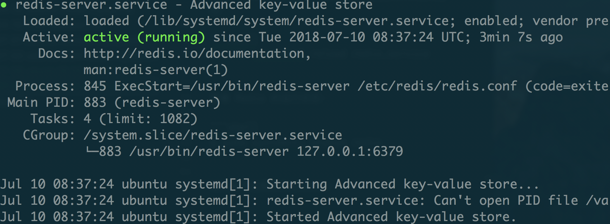

现在已经成功安装和配置了Redis并且已经开始运行。

##### 3. Redis 控制

***redis 服务控制***

启动 redis 服务：

```shell
$ sudo service redis start
```

关闭 redis 服务：

```shell
$ sudo service redis stop
```

重启 redis 服务：

```shell
$ sudo service redis restart
```

***redis 客户端连接***

在命令行中输入如下命令来登陆进 redis 客户端

```shell
$ redis-cli
```

***redis 远程连接***

打开配置文件

```shell
$ sudo vi /etc/redis/redis.conf
```

将 bind 127.0.0.1 ::1 改为 bind 0.0.0.0

之后重新启动 redis

##### 4. Redis 设置密码

打开 Redis 的配置文件

```shell
$ sudo vi /etc/redis/redis.conf
```

找到下面这一行

```shell
# requirepass foobared 
```

将注释符号去掉，将后面修改成自己的密码，如:

```shell
requirepass 123456
```


### 防火墙

#### ubuntu

##### 查看防火墙状态

```shell
sudo ufw status
```

##### 关闭防火墙

```shell
sudo ufw disablw
```

##### 打开防火墙

```shell
sudo ufw enable
```

#### centos

查看防火墙状态

```shell
firewall-cmd --state
```

停止firewall

```shell
systemctl stop firewalld.service
```

禁止firewall开机启动

```shell
systemctl disable firewalld.service 
```


### FTP

#### 第一步：在 Ubuntu 中安装 VSFTPD 服务器

1、首先，我们需要更新系统安装包列表，然后像下面这样安装 VSFTPD 二进制包：

```
$ sudo apt-get update
$ sudo apt-get install vsftpd
```

2、一旦安装完成，初始情况下服务被禁用。因此，我们需要手动开启服务，同时，启动它使得在下次开机时能够自动开启服务：

```
------------- On SystemD -------------
# systemctl start vsftpd
# systemctl enable vsftpd
------------- On SysVInit -------------
# service vsftpd start
# chkconfig --level 35 vsftpd on
```

3、接下来，如果你在服务器上启用了 [UFW 防火墙](http://www.tecmint.com/how-to-install-and-configure-ufw-firewall/)（默认情况下不启用），那么需要打开端口 20 和 21 —— FTP 守护进程正在监听它们——从而才能允许从远程机器访问 FTP 服务，然后，像下面这样添加新的防火墙规则：

```
$ sudo ufw allow 20/tcp
$ sudo ufw allow 21/tcp
$ sudo ufw status
```

#### 第二步：在 Ubuntu 中配置并保护 VSFTPD 服务器

4、让我们进行一些配置来设置和保护 FTP 服务器。首先，我们像下面这样创建一个原始配置文件 `/etc/vsftpd/vsftpd.conf` 的备份文件：

```
$ sudo cp /etc/vsftpd.conf /etc/vsftpd.conf.orig
```

接下来，打开 vsftpd 配置文件。

```
$ sudo vi /etc/vsftpd.conf
OR
$ sudo nano /etc/vsftpd.conf
```

把下面的这些选项添加/改成所展示的值：

```
anonymous_enable=NO             # 关闭匿名登录
local_enable=YES        # 允许本地用户登录
write_enable=YES        # 启用可以修改文件的 FTP 命令
local_umask=022                # 本地用户创建文件的 umask 值
dirmessage_enable=YES            # 当用户第一次进入新目录时显示提示消息
xferlog_enable=YES        # 一个存有详细的上传和下载信息的日志文件
connect_from_port_20=YES        # 在服务器上针对 PORT 类型的连接使用端口 20（FTP 数据）
xferlog_std_format=YES          # 保持标准日志文件格式
listen=NO               # 阻止 vsftpd 在独立模式下运行
listen_ipv6=YES                # vsftpd 将监听 ipv6 而不是 IPv4，你可以根据你的网络情况设置
pam_service_name=vsftpd         # vsftpd 将使用的 PAM 验证设备的名字
userlist_enable=YES              # 允许 vsftpd 加载用户名字列表
tcp_wrappers=YES          # 打开 tcp 包装器
```

5、现在，配置 VSFTPD ，基于用户列表文件 `/etc/vsftpd.userlist` 来允许或拒绝用户访问 FTP。

注意，在默认情况下，如果通过 `userlist_enable=YES` 启用了用户列表，且设置 `userlist_deny=YES` 时，那么，用户列表文件 `/etc/vsftpd.userlist` 中的用户是不能登录访问的。

但是，选项 `userlist_deny=NO` 则反转了默认设置，这种情况下只有用户名被明确列出在 `/etc/vsftpd.userlist` 中的用户才允许登录到 FTP 服务器。

```
userlist_enable=YES                   # vsftpd 将会从所给的用户列表文件中加载用户名字列表
userlist_file=/etc/vsftpd.userlist    # 存储用户名字的列表
userlist_deny=NO
```

重要的是，当用户登录 FTP 服务器以后，他们将进入 chrooted 环境，即当在 FTP 会话时，其 root 目录将是其 home 目录。

接下来，我们来看一看两种可能的途径来设置 chrooted（本地 root）目录，正如下面所展示的。

6、这时，让我们添加/修改/取消这两个选项来[将 FTP 用户限制在其 home 目录](http://www.tecmint.com/restrict-sftp-user-home-directories-using-chroot/)

```
chroot_local_user=YES
allow_writeable_chroot=YES
```

选项 `chroot_local_user=YES` 意味着本地用户将进入 chroot 环境，当登录以后默认情况下是其 home 目录。

并且我们要知道，默认情况下，出于安全原因，VSFTPD 不允许 chroot 目录具有可写权限。然而，我们可以通过选项 `allow_writeable_chroot=YES` 来改变这个设置

保存文件然后关闭。现在我们需要重启 VSFTPD 服务从而使上面的这些更改生效：

```
------------- On SystemD -------------
# systemctl restart vsftpd
------------- On SysVInit -------------
# service vsftpd restart
```

#### 第三步：在 Ubuntu 上测试 VsFTP 服务器

7、现在，我们通过使用下面展示的 [useradd 命令](http://www.tecmint.com/add-users-in-linux/)创建一个 FTP 用户来测试 FTP 服务器：

```
$ sudo useradd -m -c "Aaron Kili, Contributor" -s /bin/bash aaronkilik
$ sudo passwd aaronkilik
```

然后，我们需要像下面这样使用 [echo 命令](http://www.tecmint.com/echo-command-in-linux/)和 tee 命令来明确地列出文件 `/etc/vsftpd.userlist` 中的用户 aaronkilik：

```
$ echo "aaronkilik" | sudo tee -a /etc/vsftpd.userlist
$ cat /etc/vsftpd.userlist
```

8、现在，是时候来测试上面的配置是否具有我们想要的功能了。我们首先测试匿名登录；我们可以从下面的输出中很清楚的看到，在这个 FTP 服务器中是不允许匿名登录的：

```
# ftp 192.168.56.102
Connected to 192.168.56.102  (192.168.56.102).
220 Welcome to TecMint.com FTP service.
Name (192.168.56.102:aaronkilik) : anonymous
530 Permission denied.
Login failed.
ftp> bye
221 Goodbye.
```

9、接下来，我们将测试，如果用户的名字没有在文件 `/etc/vsftpd.userlist` 中，是否能够登录。从下面的输出中，我们看到，这是不可以的：

```
# ftp 192.168.56.102
Connected to 192.168.56.102  (192.168.56.102).
220 Welcome to TecMint.com FTP service.
Name (192.168.56.10:root) : user1
530 Permission denied.
Login failed.
ftp> bye
221 Goodbye.
```

10、现在，我们将进行最后一项测试，来确定列在文件 `/etc/vsftpd.userlist` 文件中的用户登录以后，是否实际处于 home 目录。从下面的输出中可知，是这样的：

```
# ftp 192.168.56.102
Connected to 192.168.56.102  (192.168.56.102).
220 Welcome to TecMint.com FTP service.
Name (192.168.56.102:aaronkilik) : aaronkilik
331 Please specify the password.
Password:
230 Login successful.
Remote system type is UNIX.
Using binary mode to transfer files.
ftp> ls
```

[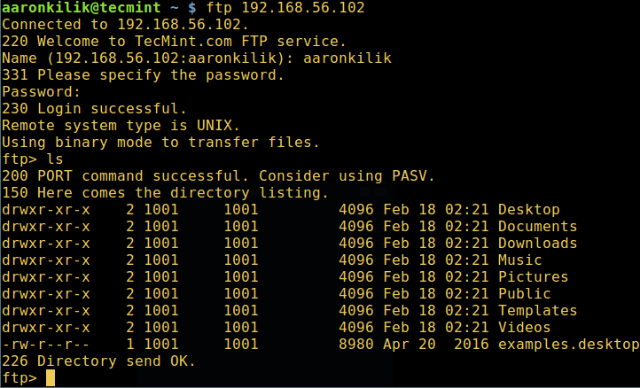](http://www.tecmint.com/wp-content/uploads/2017/02/Verify-FTP-Login-in-Ubuntu.png)

*在 Ubuntu 中确认 FTP 登录*

警告：设置选项 `allow_writeable_chroot=YES` 是很危险的，特别是如果用户具有上传权限，或者可以 shell 访问的时候，很可能会出现安全问题。只有当你确切的知道你在做什么的时候，才可以使用这个选项。

我们需要注意，这些安全问题不仅会影响到 VSFTPD，也会影响让本地用户进入 chroot 环境的 FTP daemon。

因为这些原因，在下一步中，我将阐述一个更安全的方法，来帮助用户设置一个非可写本地 root 目录。

#### 第四步：在 Ubuntu 中配置 FTP 用户的 Home 目录

11、现在，再次打开 VSFTPD 配置文件。

```
$ sudo vi /etc/vsftpd.conf
OR
$ sudo nano /etc/vsftpd.conf
```

然后像下面这样用 `#` 把不安全选项注释了：

```
#allow_writeable_chroot=YES
```

接下来，为用户创建一个替代的本地 root 目录（aaronkilik，你的可能和这不一样），然后设置目录权限，取消其他所有用户对此目录的写入权限：

```
$ sudo mkdir /home/aaronkilik/ftp
$ sudo chown nobody:nogroup /home/aaronkilik/ftp
$ sudo chmod a-w /home/aaronkilik/ftp
```

12、然后，在本地 root 目录下创建一个具有合适权限的目录，用户将在这儿存储文件：

```
$ sudo mkdir /home/aaronkilik/ftp/files
$ sudo chown -R aaronkilk:aaronkilik /home/aaronkilik/ftp/files
$ sudo chmod -R 0770 /home/aaronkilik/ftp/files/
```

之后，将 VSFTPD 配置文件中的下面这些选项添加/修改为相应的值：

```
user_sub_token=$USER          # 在本地 root 目录中插入用户名
local_root=/home/$USER/ftp    # 定义各个用户的本地 root 目录
```

保存文件并关闭。然后重启 VSFTPD 服务来使上面的设置生效：

```
------------- On SystemD -------------
# systemctl restart vsftpd
------------- On SysVInit -------------
# service vsftpd restart
```

#### 状态/启动

```shell
# 查看ftp 服务器状态     
service vsftpd status

# 启动ftp服务器     
service vsftpd start

# 重启ftp服务器 
service vsftpd restart

```

#### 自启动

参考： https://www.jianshu.com/p/79d24b4af4e5


### centos静态ip设置

```shell
cd /etc/sysconfig/network-scripts/
ls
# 选择第一个 ifcfg-xxxx 文件，打开
vim ifcfg-xxxx
# 配置如下
BOOTPROTO="static" #dhcp改为static 
ONBOOT="yes" #开机启用本配置
IPADDR=192.168.0.240 #静态IP
GATEWAY=192.168.0.1 #默认网关
NETMASK=255.255.255.0 #子网掩码
DNS1=192.168.7.1 #DNS 配置 	可以不配

```

重启网络服务：`service network restart`


## centos

### 防火墙

查看防火墙状态

```shell
firewall-cmd --state
```

停止firewall

```shell
systemctl stop firewalld.service
```

禁止firewall开机启动

```shell
systemctl disable firewalld.service 
```

开启防火墙：`systemctl start firewalld `

关闭防火墙：`systemctl stop firewalld`

开永久端口号： `firewall-cmd --add-port=666/tcp --permanent `    --permanent 表示永久生效

重新载入配置：  `firewall-cmd --reload` 	重新载入配置后才能生效

查看想开的端口是否已开： `firewall-cmd --query-port=666/tcp`

查看已开放的端口： `firewall-cmd --zone=public --list-ports`

##### 管理firewalld

```shell
# 设置开机启动服务
systemctl enable firewalld.service
# 设置开机禁用服务
systemctl disable firewalld.service
# 开启服务
systemctl start firewalld.service 
# 停止服务	
systemctl stop firewalld.service
# 查看firewalld状态
systemctl status firewalld
# 查看版本
firewall-cmd --version
# 查看帮助
firewall-cmd --help
# 显示状态
firewall-cmd --state
```

##### zone管理

```shell
# 列出所有支持的zone
firewall-cmd --get-zones
# 查看当前的默认zone
firewall-cmd --get-default-zone
```

##### service管理

```shell
# 分别列出所有支持的service
firewall-cmd --get-services
# 查看当前zone中加载的service
firewall-cmd --list-services
```

##### 基本操作

```shell
# 查看所有打开的端口
firewall-cmd --zone=public --list-ports
# 更新防火墙规则
firewall-cmd --reload
# 查看区域信息
firewall-cmd --get-active-zones
# 查看指定接口所属区域
firewall-cmd --get-zone-of-interface=eth0
# 拒绝所有包
firewall-cmd --panic-on
# 取消拒绝状态
firewall-cmd --panic-off
# 查看是否拒绝
firewall-cmd --query-panic
```

##### 添加端口

```shell
# 添加80端口
firewall-cmd --zone=public --add-port=80/tcp --permanent  # --permanent永久生效，没有此参数，重启后失效
# 重新载入	
firewall-cmd--reload
# 查看80端口
firewall-cmd --zone=public --query-port=80/tcp
# 删除80端口
firewall-cmd --zone=public --remove-port=80/tcp --permanent
# 为public区添加持久性的HTTP和HTTPS规则
firewall-cmd --zone=public --add-service=http --permanent
firewall0cmd --zone=public --add-service=https --permanent
# 列出所有规则
firewall-cmd -list-all
```


### 安装python

#### 安装依赖包

```shell
sudo yum groupinstall "Development tools"
yum install zlib-devel bzip2-devel openssl-devel ncurses-devel sqlite-devel readline-devel tk-devel gcc make
yum install libffi-devel -y

-------------------------------------------------------------------
#运行这个命令添加epel扩展源
yum -y install epel-release

#安装pip
yum install python-pip
```

#### 下载.tgz压缩包

- python包所在的位置：`https://www.python.org/ftp/python/`

#### 编译python3源码包

```shell
tar xf Python-3.7.3.tgz
cd Python-3.7.3

#进入解压后的目录，依次执行下面命令进行手动编译
./configure prefix=/usr/local/python3
make && make install
```

#### 添加软链接

```shell
#将原来的链接备份
mv /usr/bin/python /usr/bin/python.bak

#添加python3的软链接
ln -s /usr/local/python3/bin/python3.7 /usr/bin/python

# 添加pip软连接
ln -s /usr/local/python3/bin/pip3 /usr/bin/pip

#测试是否安装成功了
python -V

```

#### 更改yum配置，因为其要用到python2才能执行，否则会导致yum不能正常使用

```shell
vi /usr/bin/yum
把#! /usr/bin/python修改为#! /usr/bin/python2

vi /usr/libexec/urlgrabber-ext-down
把#! /usr/bin/python 修改为#! /usr/bin/python2
```


### 虚拟环境

#### 安装虚拟环境包

```shell
pip install virtulenv
pip install --upgrade virtualenv	# 上一步失败可以用这个

# virtualenvwrapper这个软件包可以让我们管理虚拟环境变得更加简单。不用再跑到某个目录下通过virtualenv来创建虚拟环境，并且激活的时候也要跑到具体的目录下去激活。
pip3 install virtualenvwrapper
```

#### 设置环境变量

##### 存放虚拟环境的文件夹

创建一个文件夹，用于存放所有的虚拟环境：`mkdir -p /home/python/virtualenvs` (目录自定义)

##### 编辑.bashrc文件

```shell

VIRTUALENVWRAPPER_PYTHON=/usr/local/python3/bin/python3	# 指定virtualenvwrapper执行的python版本
export WORKON_HOME=/home/python/virtualenvs	# 指定虚拟环境存放目录
source /usr/local/python3/bin/virtualenvwrapper.sh	# virtualenvwrapper.sh所在目录
```

#####  运行.bashrc文件

```shell
source ~/.bashrc
```

##### 操作

```shell
# 创建虚拟环境
mkvirtualenv spider
# 切换到某个虚拟环境
workon spider
# 退出当前虚拟环境
deactivate
# 删除某个虚拟环境
rm virtualenv spider
# 列出所有虚拟环境
ls virtualenv
# 进入到虚拟环境所在的目录
cd virtualenv

```

### chrome+chromedriver

#### 下载chrome

```shell
wget https://dl.google.com/linux/direct/google-chrome-stable_current_x86_64.rpm
```

#### 安装Chrome

```html
yum install ./google-chrome-stable_current_x86_64.rpm
```

#### 配置chromedriver

注意chromedriver的版本，要与你安装的chrome版本对应上，这里的版本已经不是最新的。版本列表：http://chromedriver.chromium.org/downloads

解压chromedriver_linux64.zip

```html
unzip chromedriver_linux64.zip
```

把chromedriver移动到系统目录

```text
mv chromedriver /usr/bin
```

为chromedriver授权

```html
chmod 755 chromedriver
```

设置无头

```python 
from selenium import webdriver   
from selenium.webdriver.chrome.options import Options  # 导入浏览器内核设置，主要是为了设置无头（headless）模式
url = 'https://www.baidu.com' 
chrome_options = Options()    
chrome_options.add_argument('--headless')  # 设置Chrome为无头模式   
chrome_options.add_argument('--no-sandbox')   #这个命令禁止沙箱模式，否则肯能会报错遇到chrome异常
chrome_options.add_argument('disable-dev-shm-usage')
driver = webdriver.Chrome(options=chrome_options)    
driver.get(url)    
driver.close()
```


