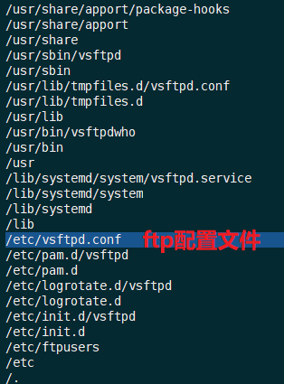
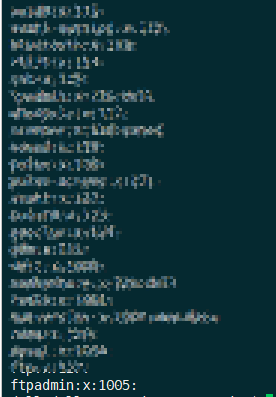

## 参考

https://www.ilanni.com/?p=10071

https://www.linuxidc.com/Linux/2018-08/153492.htm

https://www.zcfy.cc/article/how-to-install-and-configure-ftp-server-in-ubuntu#

https://murphypei.github.io/blog/2019/02/vsftpd

## 需求

现在需要在Ubuntu18.04服务器下创建一个文件夹`zdyg`，下面有文件夹`yunying`和`jishu`，要求技术人员只能访问文件夹`jishu`，运营人员只能访问文件夹`yunying`，老板可以访文件夹`zdyg`下的所有文件。

## 安装

直接使用apt-get进行安装：`sudo apt-get -y install vsftpd`

查看vsftpd都安装了那些文件：`dpkg -L vsftpd |tac`



/etc/vsftpd.conf是vsftpd的配置文件。这里和centos不同，不能将配置文件放入到/etc/vsftpd/目录下。

#### 启动/停止

```shell
sudo service vsftpd stop	# 停止

sudo service vsftpd start	# 启动

sudo service vsftpd restart	# 重启
```

#### 查看vsftpd的服务脚本

```shell
cat /lib/systemd/system/vsftpd.service
```


## 配置

vsftpd安装完毕后，我们现在开始配置vsftpd，不过在正式配置之前，我们还有几步工作要做。

### 用户相关配置

因为是使用vsftpd的虚拟用户，所以我们需要先在系统中创建一个用户，并且该用户对/www目录具有可读可写可执行权限。

#### 创建用户，如下：

```shell
sudo useradd -m -s /bin/bash ftpadmin
cat /etc/passwd |grep ftpadmin
```


>创建的用户ftpadmin现在是无法登录到系统的，因为没有给该用户设置密码。在此，我们也无需ftpadmin登录到系统，这样相对来说比较安全。

用户创建完毕后，我们来创建对应的目录并修改其所属用户，如下：

```shell
sudo mkdir /zdyg
# 将文件权限改为刚刚创建的ftpadmin用户（：前的ftpadmin为用户，：后的ftpadmin为用户所在组，在此使用的是虚拟用户，不对用户分组）
sudo chown -R ftpadmin:ftpadmin /zdyg/
sudo chmod 777 /zdyg/	#修改文件权限
```

#### 有关用户相关配置结束后，我们开始设置登录vsftp的用户与密码文件login.txt。如下：

```shell
sudo mkdir /etc/vsftpd/

sudo vim /etc/vsftpd/login.txt	# 存放用户名与密码
```

在 `/etc/vsftpd/login.txt` 文件中添加如下：(一行账号，一行密码)

```
yunying			# 运营账号
yunyingpasswd	# 运营密码
guanli			# 管理账号
guanlipasswd	# 管理密码
jishu			# 技术账号
jishupasswd		# 技术密码
```

#### login.txt设置完毕后，我们要使用db_load进行加密。而db_load需要db-util这个软件。所以需要我们现在安装db-util，如下：

```shell
sudo apt-get -y install db-util
```

db-util安装完毕后，现在开始使用db_load对loginx.txt进行加密。如下：

```shell
sudo db_load -T -t hash -f /etc/vsftpd/login.txt /etc/vsftpd/login.db
```

> 需要注意的是，以后对虚拟用户的增删操作完之后需要再次执行上述命令，使其生成新的数据文件。

loginx.txt加密完成后，我们现在开始配置vsftpd的PAM验证。

### PAM验证配置

vsftpd的PAM验证，这里没有使用vsftpd安装时所生成的/etc/pam.d/vsftpd文件。因为经过多次的测试，发现如果使用该文件进行验证的话，无法验证通过。不知道为什么，猜想很有可能是vsftpd的一个BUG。

创建验证文件，如下：

```shell
sudo vim /etc/pam.d/vsftpd.virtual
```

文件中添加内容：

```
auth required pam_userdb.so db=/etc/vsftpd/login

account required pam_userdb.so db=/etc/vsftpd/login
```

vsftpd.virtual文件的内容，也可以根据OS的版本进行调整。我现在使用的是ubuntu x64，所以也可以填写为：

```
auth required /lib/x86_64-linux-gnu/security/pam_userdb.so db=/etc/vsftpd/login

account required /lib/x86_64-linux-gnu/security/pam_userdb.so db=/etc/vsftpd/login
```

> 其中/etc/vsftpd/login对应/etc/vsftpd/login.db文件

### vsftp权限配置

现在正式配置vsftpd，vsftpd的几乎所有配置项都在/etc/vsftpd.conf文件中进行。

根据业务要求vsftpd.conf配置内容如下：

```shell
# 查看vsftpd.conf中的配置
grep -vE “^#|^$” /etc/vsftpd.conf
```

配置如下：

```
listen=YES	#默认
listen_ipv6=NO	#默认
anonymous_enable=NO	#设置为NO代表不允许匿名
local_enable=YES	#设定本地用户可以访问，主要是虚拟宿主用户，如果设为NO那么所有虚拟用户将无法访问。
write_enable=YES	#可以进行写的操作，此项一定要为YES，否则不能上传文件
local_umask=022		#设定上传文件的权限掩码，022对应755
dirmessage_enable=YES	# 设定开启目录标语功能
use_localtime=YES	# 时间设置
xferlog_enable=YES	# 设定开启日志记录功能
connect_from_port_20=YES	#设定端口20进行数据连接
xferlog_file=/var/log/vsftpd.log	#设定vsftpd服务日志保存路劲。注意：该文件默认不存在，需手动touch，且由于这里更改了vsftpd服务的宿主用户为手动建立的vsftpd，则必须注意给予该用户对日志的读取权限否则服务启动失败。
xferlog_std_format=YES	#设定日志使用标准的记录格式
chroot_local_user=YES	#是否将所有用户限制在主目录，YES 为启用 NO 禁用（该项默认值是 NO，即在安装 vsftpd 后不做配置的话，ftp 用户是可以向上切换到要目录之外的）
chroot_list_enable=NO	#是否启动限制用户的名单 YES 为启用 NO 禁用（包括注释掉也为禁用）
allow_writeable_chroot=YES	#允许写操作
secure_chroot_dir=/var/run/vsftpd/empty	# 默认
pam_service_name=vsftpd	# 默认
rsa_cert_file=/etc/ssl/certs/ssl-cert-snakeoil.pem	# 默认
rsa_private_key_file=/etc/ssl/private/ssl-cert-snakeoil.key	# 默认
ssl_enable=NO	# 默认
guest_enable=YES	#启用vsftpd虚拟用户
pam_service_name=vsftpd.virtual	#PAM验证文件
user_config_dir=/etc/vsftpd/vu	#虚拟用户账号配置目录
pasv_enable=YES	#下面三项是启用vsftpd被动模式及相关端口
pasv_min_port=30000
pasv_max_port=31000

```

在以上配置文件中，有几点需要重点指出。

```
local_enable=YES
write_enable=YES
local_umask=022
这两项是启用系统用户的写权限。特别是write_enable=YES项一定要启用，否则vsftpd虚拟用户将无法登录vsftpd。
为什么会是这样？因为虚拟用户依赖与系统用户。

chroot_local_user=YES
chroot_list_enable=NO
allow_writeable_chroot=YES
这三项是配置vsftpd用户禁止切换上级目录的权限。

guest_enable=YES
pam_service_name=vsftpd.virtual
user_config_dir=/etc/vsftpd/vu
这三项是启用vsftpd虚拟用以及虚拟用户账号配置目录。

pasv_enable=YES
pasv_min_port=30000
pasv_max_port=31000
这三项是启用vsftpd被动模式及相关端口。
```


### 虚拟用户配置

vsftpd配置文件修改文件后，现在开始配置虚拟用户的相关权限。如下：

```shell
sudo mkdir /etc/vsftpd/vu
sudo vim /etc/vsftpd/vu/guanli
```

配置如下：（guanli可访问的配置）

```shell
guest_username=ftpadmin
local_root=/zdyg/
virtual_use_local_privs=YES
anon_umask=133
```

运营账号配置

```shell
sudo vim /etc/vsftpd/vu/yunying

配置如下：
guest_username=ftpadmin
local_root=/zdyg/yunying/
virtual_use_local_privs=YES
anon_umask=133
```

技术账号配置

```shell
sudo vim /etc/vsftpd/vu/jishu

配置如下：
guest_username=ftpadmin
local_root=/zdyg/jishu/
virtual_use_local_privs=YES
anon_umask=133
```

> 以上配置参数，其中guest_username=ftpilanni表示的是设置FTP对应的系统用户为ftpadmin
>
> local_root=/zdyg/表示使用本地用户登录到ftp时的默认目录。
>
> virtual_use_local_privs=YES虚拟用户和本地用户有相同的权限。
>
> anon_umask表示文件上传的默认掩码。计算方式是777减去anon_umask就是上传文件的权限。在此我们设置的是133，也就是说上传后文件的权限是644。即上传的文件对所属用户来说只有读写权限，没有执行权限。

以上全部配置完毕后，我们来重启vsftpd，如下：

```shell
sudo service vsftpd restart
```


## 删除

卸载FTP

```shell
sudo apt-get remove --purge vsftpd
(--purge 选项表示彻底删除改软件和相关文件)
```

删除用户：

```shell
sudo vim /etc/passwd	#进入用户配置文件，找到并删除需要删除的用户
```


删除组：

```shell
sudo vim /etc/group		#进入用户组配置文件，找到并删除需要删除的用户组
```



# Ubuntu 文件文件夹查看权限和设置权限

参考：https://blog.csdn.net/xianjie0318/article/details/65444938?locationNum=2&fps=1

https://blog.csdn.net/langzi7758521/article/details/51190425


ubuntu下查看权限的命令为：

```shell
ls -l filename

ls -ld folder
```

ubuntu下设置权限的命令为：
一共有10位数

其中： 最前面那个 - 代表的是类型

中间那三个 rw- 代表的是所有者（user）

然后那三个 rw- 代表的是组群（group）

最后那三个 r-- 代表的是其他人（other）

 

然后我再解释一下后面那9位数：

r 表示文件可以被读（read）

w 表示文件可以被写（write）

x 表示文件可以被执行（如果它是程序的话）

- 表示相应的权限还没有被授予

 

现在该说说修改文件权限了

在终端输入：

chmod o+w xxx.xxx

表示给其他人授予写xxx.xxx这个文件的权限

chmod go-rw xxx.xxx

表示删除xxx.xxx中组群和其他人的读和写的权限


其中：

u 代表所有者（user）

g 代表所有者所在的组群（group）

o 代表其他人，但不是u和g （other）

a 代表全部的人，也就是包括u，g和o

 

r 表示文件可以被读（read）

w 表示文件可以被写（write）

x 表示文件可以被执行（如果它是程序的话）

 

其中：rwx也可以用数字来代替

r ------------4

w -----------2

x ------------1

`-`------------0

 

行动：

`+`表示添加权限

`-`表示删除权限

= 表示使之成为唯一的权限

 

当大家都明白了上面的东西之后，那么我们常见的以下的一些权限就很容易都明白了：

-rw------- (600) 只有所有者才有读和写的权限

-rw-r--r-- (644) 只有所有者才有读和写的权限，组群和其他人只有读的权限

-rwx------ (700) 只有所有者才有读，写，执行的权限

-rwxr-xr-x (755) 只有所有者才有读，写，执行的权限，组群和其他人只有读和执行的权限

-rwx--x--x (711) 只有所有者才有读，写，执行的权限，组群和其他人只有执行的权限

-rw-rw-rw- (666) 每个人都有读写的权限

-rwxrwxrwx (777) 每个人都有读写和执行的权限

```
sudo chmod 600 ××× （只有所有者有读和写的权限） 

sudo chmod 644 ××× （所有者有读和写的权限，组用户只有读的权限） 

sudo chmod 700 ××× （只有所有者有读和写以及执行的权限） 

sudo chmod 666 ××× （每个人都有读和写的权限） 

sudo chmod 777 ××× （每个人都有读和写以及执行的权限）
```


若分配给某个文件所有权限，则利用下面的命令：
sudo chmod -R 777 文件或文件夹的名字（其中sudo是管理员权限）
